# AI教务助手 - 技术方案

> **版本**: v1.0  
> **日期**: 2026-07-15  
> **状态**: 方案设计阶段  

---

## 目录

1. [项目概述](#1-项目概述)
2. [系统架构设计](#2-系统架构设计)
3. [功能模块详细设计](#3-功能模块详细设计)
4. [数据模型设计](#4-数据模型设计)
5. [AI引擎设计](#5-ai引擎设计)
6. [API接口设计](#6-api接口设计)
7. [安全与权限设计](#7-安全与权限设计)
8. [部署与运维](#8-部署与运维)
9. [项目里程碑建议](#9-项目里程碑建议)

---

## 1. 项目概述

### 1.1 项目背景

高校教务管理面临以下痛点：
- 培养方案日趋复杂，学生难以全面理解毕业要求
- 选课季咨询量激增，教务人员应接不暇
- 课程替代、学分认定等特殊情况依赖人工经验
- 学生学业进度缺乏主动预警机制

AI教务助手旨在通过大语言模型（LLM）独立构建智能教务咨询能力。系统不依赖外部教务系统API，所有数据（培养方案、课程目录、学生成绩、课表等）通过后台管理端手动导入或录入，适配无OpenAPI对接条件的高校场景，提供7×24小时智能教务咨询服务。

### 1.2 用户角色

| 角色 | 核心诉求 | 典型场景 |
|------|---------|---------|
| **在校生** | 选课建议、学分查询、毕业差距分析 | "我还差多少学分毕业？"、"这门课有先修要求吗？" |
| **教务处** | 规则配置、咨询统计、全局数据分析 | 查看热门咨询主题、发现培养方案表述歧义 |
| **学院教学秘书** | 特殊方案维护、人工纠错、本院数据管理 | 维护本院特殊培养方案、纠正AI错误回答 |

### 1.3 核心功能边界

| 能做 | 不能做 |
|------|--------|
| 查询先修条件并给出选课建议 | 代替学生提交选课申请 |
| 核验学分结构是否符合培养方案 | 修改教务系统中的成绩数据 |
| 检测课程时间冲突 | 绕过培养方案要求做学分认定 |
| 推荐可替代课程（附规则依据） | 在无规则支撑时自行编造依据 |
| 输出结果附具体规则条款引用 | 提供非教务范畴的建议 |

### 1.4 产品描述核心能力映射

```
读取能力：培养方案 + 课程目录 + 学生成绩 + 当前课表
         ───────────────  ───────────────
              知识库层          数据接入层

检查能力：先修条件 → 学分结构 → 课程冲突 → 毕业要求
         ─────────────────────────────────────
                    规则引擎

查询能力：自然语言 → 意图识别 → 规则匹配 → 结果+依据
         ─────────────────────────────────────
                    AI对话层
```

---

## 2. 系统架构设计

### 2.1 整体架构

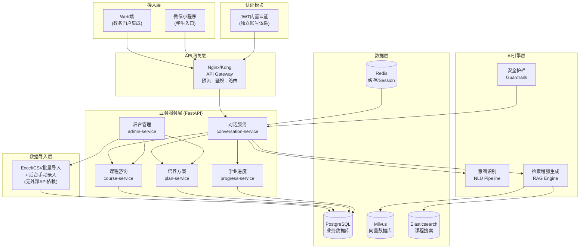

### 2.2 技术栈选型

| 层次 | 技术选型 | 选型理由 |
|------|---------|---------|
| **Web框架** | FastAPI (Python 3.12+) | 异步高性能、Pydantic类型校验、自动OpenAPI文档 |
| **AI编排** | LangChain + LangGraph | 多步骤推理链编排、工具调用、上下文管理 |
| **LLM** | Claude Opus 4 / 本地部署Qwen3 | 高精度推理 + 可私有化部署 |
| **向量数据库** | Milvus | 高性能ANN检索，支持混合搜索 |
| **关系数据库** | PostgreSQL 16 + pgvector | 业务数据存储 + 结构化向量检索 |
| **搜索引擎** | Elasticsearch 8.x | 课程目录全文搜索、模糊匹配 |
| **缓存** | Redis 7.x | 对话Session、热点数据缓存、限流计数 |
| **消息队列** | Redis Streams | 轻量异步任务（统计聚合、向量化） |
| **任务调度** | Celery + Celery Beat | 定时报表生成、向量索引重建 |
| **监控** | Prometheus + Grafana | 指标采集与可视化 |
| **日志** | ELK (Elasticsearch + Logstash + Kibana) | 集中日志、审计追溯 |
| **容器化** | Docker + Docker Compose (开发) / K8s (生产) | 环境一致性、弹性伸缩 |

### 2.3 关键设计决策

#### 决策一：LLM+RAG 混合架构

```
用户问题 → NLU意图分类 → ┬→ 事实查询（查课/查分）→ 规则引擎 → SQL查询 → 结构化回答
                          │
                          └→ 咨询推理（选课建议）→ RAG检索 → LLM生成 → 溯源校验 → 附依据回答
```

- **事实查询走规则引擎**：先修条件、学分统计、冲突检测等确定性计算不走LLM，保证100%准确性
- **咨询推理走RAG+LLM**：开放式建议、方案解读等语义理解场景由LLM生成，但事后经规则引擎校验
- **所有输出必须挂载规则来源**：无论是规则引擎输出还是LLM生成内容，最终回答中每条结论必须引用具体规则条款

#### 决策二：规则引擎独立于LLM

LLM负责理解用户意图和生成自然语言回复，但**不参与逻辑判断**。所有业务规则（先修条件、学分要求、替代规则）由独立的`RuleEngine`模块执行，确保：
- 规则变更无需重新训练或调整提示词
- 每条判断结果可精确追溯到具体规则条目
- 避免LLM幻觉导致错误教务指导

#### 决策四：独立数据管理（无外部API依赖）

系统不假设学校提供教务OpenAPI，所有数据通过以下方式自维护：
- **后台录入**：教务处/教学秘书通过管理界面逐条录入或编辑
- **Excel/CSV批量导入**：提供模板下载→填充→上传→校验→入库的标准流程
- **版本快照**：每学期初导入数据做版本标记，支持回看历史方案

这带来额外设计要求：
- 数据导入须有严格校验（字段完整性、外键关联、学分值域）
- 提供导入预览和回滚能力
- 学生成绩/课表数据与培养方案来源同一套手动维护的数据集
- 系统内置开发用种子数据，便于功能演示和测试

#### 决策三：三层知识检索

```
Layer 1: 精确匹配 → 课程代码、学生学号 → 关系数据库
Layer 2: 语义检索 → 培养方案解读、课程描述 → 向量数据库
Layer 3: 全文搜索 → 课程名称模糊查找、规则关键词 → Elasticsearch
```

---

## 3. 功能模块详细设计

### 3.1 选课咨询模块 (Course Consultation)

#### 3.1.1 模块职责

- 对指定课程检查先修条件是否满足
- 检测课程时间是否与已有课表冲突
- 根据已修课程推荐可选的后续课程
- 回答"某课程能否替代某课程"类问题

#### 3.1.2 核心流程

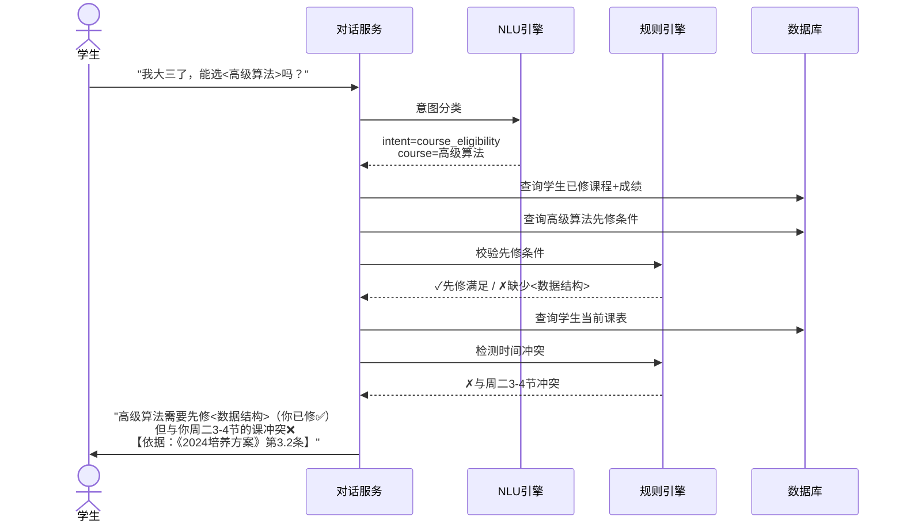

#### 3.1.3 先修条件检查

支持三种先修条件类型：

| 条件类型 | 示例 | 检查方式 |
|---------|------|---------|
| 课程先修 | 必须先修《数据结构》 | 查成绩表是否通过 |
| 学分先修 | 需修满60学分 | 统计已修学分 |
| 年级/专业限制 | 限大三以上CS专业 | 查学籍信息 |
| 复合条件 | (课程A或课程B) 且 学分≥40 | 布尔表达式求值 |

规则表达式示例：
```json
{
  "course_id": "CS401",
  "prerequisites": {
    "logic": "AND",
    "conditions": [
      {"type": "course", "course_id": "CS201", "min_grade": 60},
      {"type": "credit", "min_credits": 40},
      {"type": "grade_level", "min": 3}
    ]
  }
}
```

#### 3.1.4 课程替代查询

```
学生问：“我修过《操作系统原理》，能替代《操作系统》吗？”

处理流程：
1. 检索课程替代规则库（教务处在admin-service中维护）
2. 匹配规则：{source: "操作系统原理", target: "操作系统", condition: "得分≥75", approver: "学院审批"}
3. 返回结果 + 规则引用 + 替代流程指引
```

### 3.2 培养方案核验模块 (Plan Verification)

#### 3.2.1 模块职责

- 加载指定专业/年级的标准培养方案
- 对比学生已修课程与方案要求
- 按类别（通识必修/专业必修/专业选修/实践环节）统计差距
- 支持教务处维护多版本培养方案

#### 3.2.2 培养方案结构模型

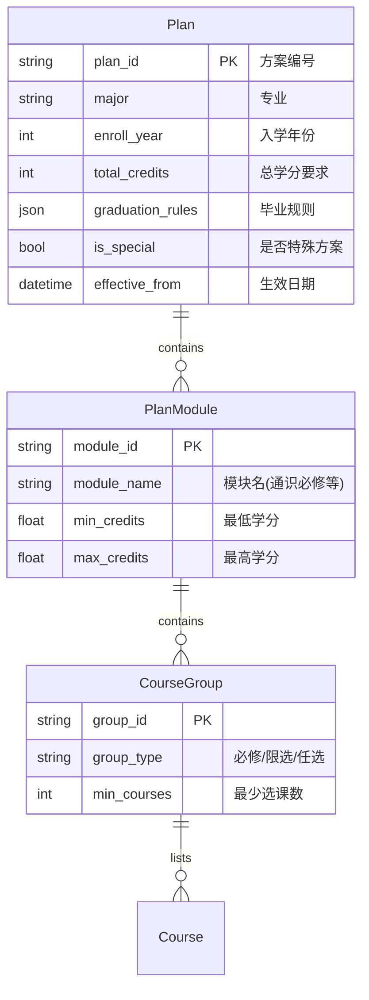

#### 3.2.3 核验输出示例

```markdown
## 学业进度报告 - 张三 (2024级 计算机科学与技术)

### 已完成
| 模块 | 要求 | 已修 | 差距 |
|------|------|------|------|
| 通识必修 | 28学分 | 24学分 | ⚠️ 缺4学分 |
| 专业必修 | 45学分 | 42学分 | ⚠️ 缺3学分 |
| 专业选修 | 12学分 | 14学分 | ✅ 已完成 |
| 实践环节 | 8学分 | 2学分 | ❌ 缺6学分 |

### 必修课缺口明细
- 大学英语IV (2学分) — 通识必修
- 编译原理 (3学分) — 专业必修

### 毕业可行性
距离毕业要求还差13学分。进度正常，但请注意实践环节缺口较大。
【依据：《计算机科学与技术2024级培养方案》第2-6条】
```

### 3.3 学业进度分析模块 (Progress Analysis)

#### 3.3.1 模块职责

- 按学期可视化展示学业完成度
- 预测剩余学期课程安排建议
- 预警可能影响毕业的风险项
- 生成个性化学习路径建议

#### 3.3.2 分析维度

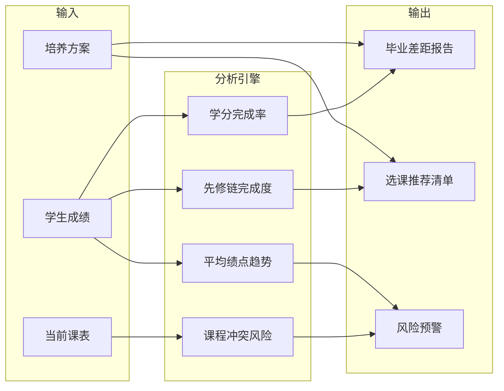

#### 3.3.3 风险预警规则

| 风险类型 | 触发条件 | 预警级别 |
|---------|---------|---------|
| 学分滞后 | 当前学期完成率 < 正常进度的80% | 黄色 |
| 必修挂科 | 必修课不及格且当学期未安排重修 | 红色 |
| 先修断链 | 后续学期必修课的前序课程未修 | 红色 |
| 实践缺口 | 大四上学期实践学分不足50% | 红色 |
| 绩点偏低 | 累计GPA < 2.0 | 黄色 |

### 3.4 后台管理模块 (Admin Console)

#### 3.4.1 模块职责

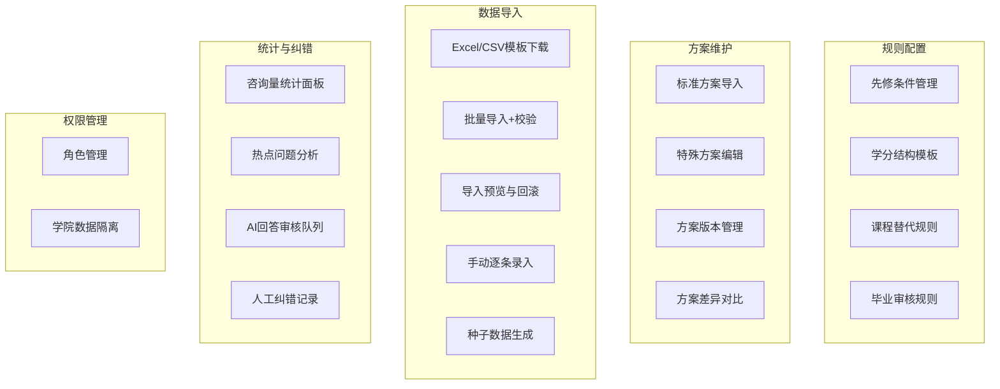

#### 3.4.2 咨询统计面板

提供给教务处的统计维度：
- 日/周/月咨询量趋势
- 高频意图分布（选课咨询/学分查询/课程替代/其他）
- 各学院咨询量对比
- 未命中问题聚类（需补充知识库）
- 学生满意度评价分布
- 人工介入率趋势

#### 3.4.3 人工纠错机制

```
AI回答 → 学生评价"不准确" → 进入审核队列
                                ↓
                    教学秘书审核 → 标记正确（驳回）
                                → 确认错误 → 标注正确答案
                                            → 加入反馈训练集
                                            → 触发规则更新（如需要）
                                → 升级至教务处（复杂/全局性问题）
```

#### 3.4.4 数据导入模块

系统不依赖外部教务系统API，所有基础数据通过后台导入。支持以下数据类型：

| 数据类型 | 导入方式 | 校验要点 |
|---------|---------|---------|
| 专业目录 | Excel批量导入 / 手动录入 | 专业代码唯一性、学院归属 |
| 学生信息 | Excel批量导入 | 学号唯一性、专业代码外键、入学年份合法性 |
| 课程目录 | Excel批量导入 | 课程代码唯一性、学分范围(0.5-20)、开课学院外键 |
| 培养方案 | Excel模板 + JSON规则 | 方案编号唯一性、关联课程存在性、学分加总一致性 |
| 学生成绩 | Excel批量导入 | 学号+课程代码外键、成绩范围(0-100)、学期格式 |
| 学生课表 | Excel批量导入 | 学号+课程代码外键、时间槽位不重叠 |
| 先修条件 | 后台表单录入 | 条件表达式合法性、目标课程存在性 |
| 替代规则 | 后台表单录入 | 源/目标课程存在性、条件表达式合法性 |

**导入流程**：

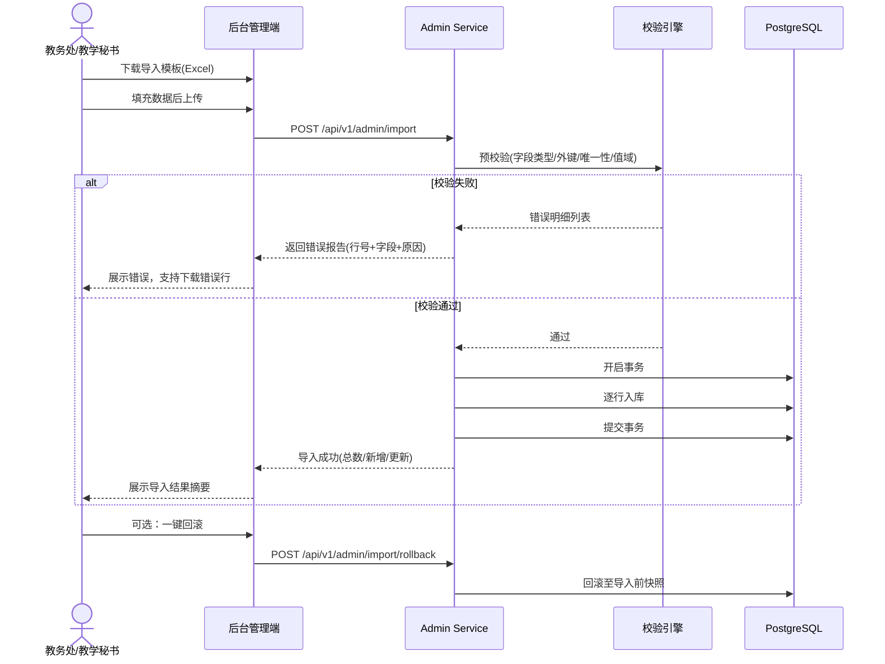

**种子数据**（开发/演示用）：

系统内置一套模拟数据脚本 `seed_data.py`，包含：
- 3个学院、6个专业、3个年级
- 约200门课程（含课程描述，用于RAG检索）
- 3份标准培养方案（2019/2023/2024级）
- 50名模拟学生及其成绩与课表
- 预设先修条件规则和替代规则

种子数据通过 `python seed_data.py` 一键初始化，便于功能演示与开发测试。

---

## 4. 数据模型设计

### 4.1 核心实体关系图

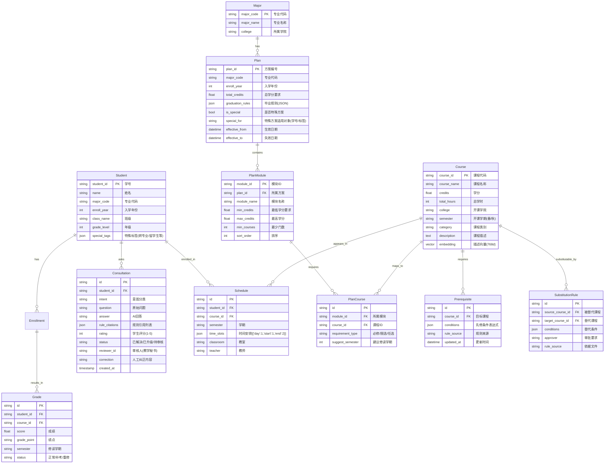

### 4.2 培养方案JSON存储设计

培养方案中的灵活规则以JSON存储，适应不同专业格式差异：

```json
{
  "graduation_rules": {
    "min_total_credits": 160,
    "min_gpa": 2.0,
    "max_study_years": 6,
    "modules": [
      {
        "name": "通识教育必修",
        "min_credits": 28,
        "course_groups": [
          {
            "type": "required",
            "courses": ["ENG101", "ENG102", "MATH101"],
            "total_credits": 12
          },
          {
            "type": "choose_n",
            "n": 4,
            "pool": ["HIST101", "PHIL101", "ART101", "MUS101", "ECON101"],
            "total_credits": 8
          }
        ]
      }
    ]
  },
  "substitution_rules": [
    {
      "rule_id": "SUB001",
      "source": "CS301_OLD",
      "target": "CS401",
      "condition": "score >= 75 AND approval = 'college'",
      "note": "2019级及以前培养方案中的旧课程"
    }
  ]
}
```

### 4.3 向量数据库设计

| Collection | 向量维度 | 索引类型 | 用途 |
|------------|---------|---------|------|
| `course_embeddings` | 768 (text2vec-large-chinese) | IVF_FLAT | 课程描述语义检索 |
| `plan_embeddings` | 768 | IVF_FLAT | 培养方案条款语义检索 |
| `rule_embeddings` | 768 | IVF_FLAT | 规章制度语义检索 |
| `faq_embeddings` | 768 | IVF_FLAT | 常见问题匹配 |
| `consultation_history` | 768 | IVF_FLAT | 历史咨询相似检索 |

---

## 5. AI引擎设计

### 5.1 整体流水线

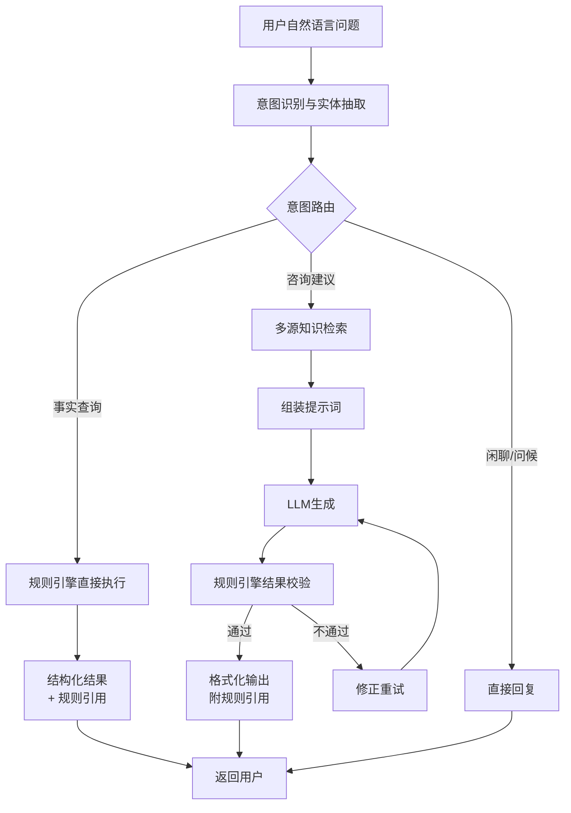

### 5.2 意图识别设计

```python
# 意图分类体系
INTENT_SCHEMA = {
    "course_eligibility": {  # 选课资格查询
        "slots": ["course_name", "course_id"],
        "examples": ["我能选{高级算法}吗", "{CS401}有先修要求吗"]
    },
    "credit_check": {  # 学分查询
        "slots": ["module_name"],
        "examples": ["我还差多少学分", "{通识选修}还要选几门"]
    },
    "course_substitution": {  # 课程替代
        "slots": ["source_course", "target_course"],
        "examples": ["{操作系统原理}能替代{操作系统}吗"]
    },
    "progress_report": {  # 学业进度
        "slots": [],
        "examples": ["我的学业进度怎么样", "我能按时毕业吗"]
    },
    "course_conflict": {  # 课程冲突
        "slots": ["course_id"],
        "examples": ["选{CS401}会和我课表冲突吗"]
    },
    "plan_query": {  # 培养方案查询
        "slots": ["plan_clause"],
        "examples": ["我们专业选修课要多少学分", "实践环节要求是什么"]
    },
    "course_search": {  # 课程搜索
        "slots": ["keyword"],
        "examples": ["下学期有哪些AI相关的选修课", "推荐几门好过的通识课"]
    }
}
```

意图识别采用**规则粗筛 + 向量细分类**两级策略：
- **第一级（规则）**：关键词正则匹配，处理高频标准化问法，命中率约60%
- **第二级（向量）**：使用训练好的意图分类模型（基于BERT微调），处理长尾表达

### 5.3 RAG检索流程

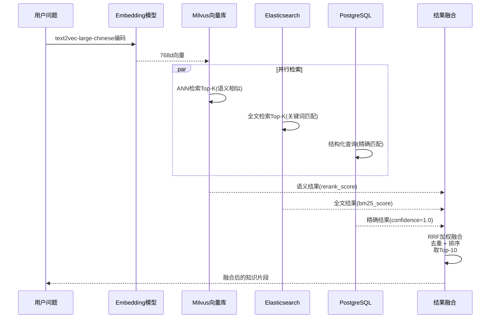

#### RRF (Reciprocal Rank Fusion) 融合策略

```
score(doc) = Σ 1/(k + rank_i(doc))
```

其中 k=60，对三个检索引擎的结果统一排名融合。

### 5.4 Prompt工程

#### 系统提示词核心约束

```text
你是高校AI教务助手。回答问题时必须遵守：

1. 【角色边界】你只提供咨询和建议，不得模拟或代替学生进行任何选课操作。
   如用户提出代选课请求，回复："根据规定，选课须由学生本人操作，我可以帮你确认选课条件。"

2. 【依据强制】每条结论必须引用具体规则来源，格式：【依据：《XXX培养方案》第X条】
   无法找到依据时，回复："该问题需咨询所在学院教学秘书确认。"

3. 【准确性优先】不确定的信息宁可说不确定，绝不猜测。
   当学生信息不完整时主动追问学号/专业/年级等关键信息。

4. 【隐私保护】不主动展示其他学生的成绩、课表等隐私数据。
   不在对话中暴露系统内部设计细节。

5. 【反馈引导】回答末尾引导："如果我的回答有误，请点击「纠错」提交给教学秘书审核。"
```

### 5.5 安全护栏设计

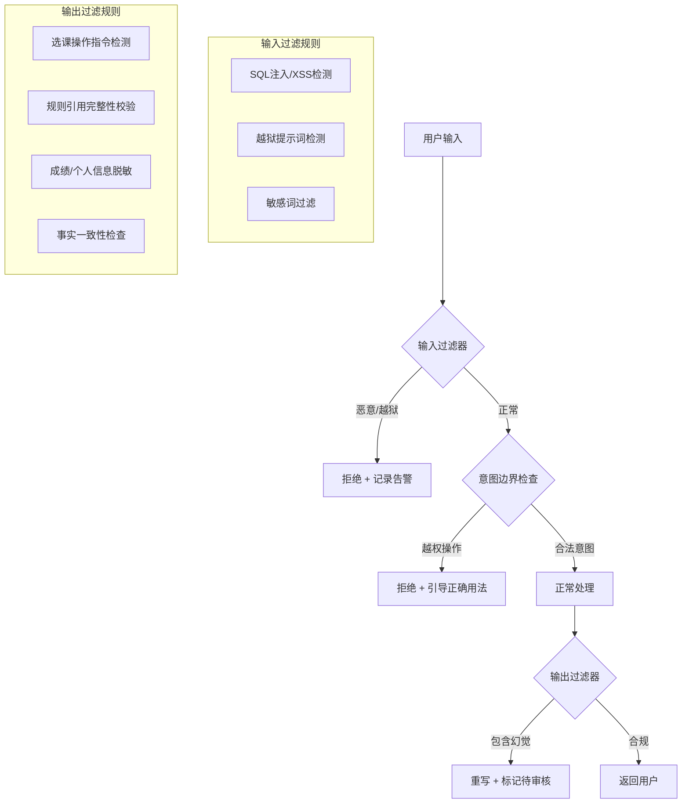

#### 关键护栏规则

| 检查点 | 规则 | 动作 |
|-------|------|------|
| 输入 | 含"帮我选课""帮我退课"等操作动词 | 拒绝并引导 |
| 输入 | 含越狱提示词模板 | 拒绝并告警 |
| 输出 | 包含选课系统操作链接/按钮 | 自动移除 |
| 输出 | 结论缺少【依据】标注 | 补充后输出 |
| 输出 | 成绩数值与数据库不符 | 不输出，重试 |
| 输出 | 引用的规则ID在规则库中不存在 | 不输出，标记审核 |

### 5.6 工具调用设计

LLM通过Function Calling与业务服务交互，获取准确数据：

```python
# 工具定义（LangChain Tool格式）
TOOLS = [
    {
        "name": "get_student_grades",
        "description": "获取学生已修课程成绩",
        "parameters": {"student_id": "学号"}
    },
    {
        "name": "get_course_prerequisites",
        "description": "查询课程的先修条件",
        "parameters": {"course_id": "课程代码"}
    },
    {
        "name": "check_schedule_conflict",
        "description": "检测课程是否与学生课表冲突",
        "parameters": {"student_id": "学号", "course_id": "课程代码"}
    },
    {
        "name": "get_plan_progress",
        "description": "获取学生培养方案完成进度",
        "parameters": {"student_id": "学号"}
    },
    {
        "name": "search_substitution_rules",
        "description": "搜索课程替代规则",
        "parameters": {"source_course": "原课程", "target_course": "目标课程"}
    },
    {
        "name": "search_courses",
        "description": "按关键词/类别搜索课程目录",
        "parameters": {"keyword": "搜索词", "category": "课程类别(可选)", "semester": "开课学期(可选)"}
    }
]
```

---

## 6. API接口设计

### 6.1 接口总览

| 服务 | 端点 | 方法 | 说明 | 调用方 |
|------|------|------|------|--------|
| 对话 | `/api/v1/chat` | POST | 核心对话接口 | 前端 |
| 对话 | `/api/v1/chat/{session_id}` | GET | 获取历史对话 | 前端 |
| 对话 | `/api/v1/chat/feedback` | POST | 提交回答反馈 | 前端 |
| 课程 | `/api/v1/courses` | GET | 课程搜索列表 | 对话服务/前端 |
| 课程 | `/api/v1/courses/{id}/prerequisites` | GET | 查询先修条件 | 对话服务 |
| 方案 | `/api/v1/plans/progress` | GET | 学业进度核验 | 对话服务/前端 |
| 方案 | `/api/v1/plans/{plan_id}` | GET | 培养方案详情 | 前端 |
| 后台 | `/api/v1/admin/rules` | CRUD | 规则管理 | 后台 |
| 后台 | `/api/v1/admin/plans` | CRUD | 方案管理 | 后台 |
| 后台 | `/api/v1/admin/import` | POST | 批量导入数据 | 后台 |
| 后台 | `/api/v1/admin/import/template/{type}` | GET | 下载导入模板 | 后台 |
| 后台 | `/api/v1/admin/import/rollback/{batch_id}` | POST | 回滚导入批次 | 后台 |
| 后台 | `/api/v1/admin/consultations/stats` | GET | 咨询统计 | 后台 |
| 后台 | `/api/v1/admin/corrections` | POST | 提交纠错 | 后台 |
| 后台 | `/api/v1/admin/students` | CRUD | 学生信息管理 | 后台 |
| 后台 | `/api/v1/admin/courses` | CRUD | 课程目录管理 | 后台 |
| 后台 | `/api/v1/admin/grades` | CRUD | 成绩管理 | 后台 |
| 后台 | `/api/v1/admin/schedules` | CRUD | 课表管理 | 后台 |
| 认证 | `/api/v1/auth/login` | POST | 用户登录 | 前端 |
| 认证 | `/api/v1/auth/refresh` | POST | 刷新Token | 前端 |

### 6.2 核心接口详情

#### 6.2.1 对话接口

**POST /api/v1/chat**

```json
// 请求
{
  "session_id": "sess_abc123",
  "message": "我还差多少学分毕业？",
  "student_id": "20240101001"
}

// 响应
{
  "code": 0,
  "data": {
    "reply": "根据你2024级计算机科学与技术专业的培养方案，总学分要求为160学分。\n\n你目前已修128学分，还差**32学分**，具体分布：\n- 通识必修：已修24/28，差4学分\n- 专业必修：已修42/45，差3学分\n...\n\n【依据：《计算机科学与技术2024级培养方案》第2-6条】",
    "rule_citations": [
      {"rule_id": "PLAN_CS2024_2", "text": "通识教育必修课不低于28学分", "source": "《计算机科学与技术2024级培养方案》第2条"},
      {"rule_id": "PLAN_CS2024_3", "text": "专业必修课不低于45学分", "source": "《计算机科学与技术2024级培养方案》第3条"}
    ],
    "confidence": 0.95,
    "suggestions": ["我的必修课还差哪些？", "推荐几门专业选修课"]
  }
}
```

#### 6.2.2 学业进度接口

**GET /api/v1/plans/progress?student_id=20240101001**

```json
{
  "code": 0,
  "data": {
    "student_info": {
      "student_id": "20240101001",
      "name": "张三",
      "major": "计算机科学与技术",
      "enroll_year": 2024,
      "grade_level": 3,
      "current_semester": "2025-2026-2"
    },
    "progress": {
      "total_credits_required": 160,
      "total_credits_earned": 128,
      "completion_rate": 0.80,
      "gpa": 3.2,
      "modules": [
        {"name": "通识必修", "required": 28, "earned": 24, "status": "incomplete"},
        {"name": "专业必修", "required": 45, "earned": 42, "status": "incomplete"},
        {"name": "专业选修", "required": 12, "earned": 14, "status": "complete"},
        {"name": "实践环节", "required": 8, "earned": 2, "status": "incomplete"}
      ],
      "missing_courses": [
        {"course_id": "ENG104", "course_name": "大学英语IV", "credits": 2, "module": "通识必修"},
        {"course_id": "CS301", "course_name": "编译原理", "credits": 3, "module": "专业必修"}
      ]
    },
    "risks": [
      {"type": "practice_deficit", "level": "red", "message": "实践环节仅完成25%，大三下学期应有60%以上完成度"}
    ]
  }
}
```

#### 6.2.3 反馈与纠错接口

**POST /api/v1/chat/feedback**

```json
{
  "consultation_id": "c_20260715_001",
  "rating": 2,
  "is_inaccurate": true,
  "correction_note": "编译原理的学分应该是4学分，不是3学分"
}
```

### 6.3 鉴权方案

系统采用内置账号体系，不依赖学校统一认证（可后续对接CAS/LDAP）。

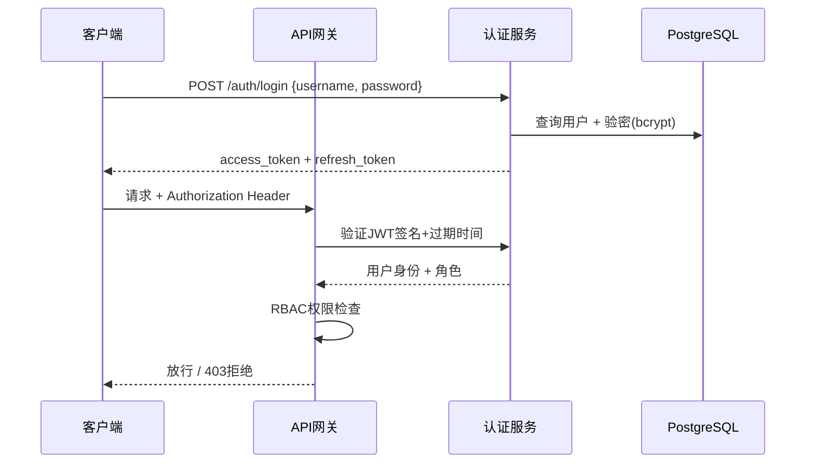

| 配置项 | 值 |
|-------|---|
| Token类型 | JWT (HS256签名) |
| 密码存储 | bcrypt哈希 |
| Access Token有效期 | 2小时 |
| Refresh Token有效期 | 7天 |
| 身份源 | 系统内置账号体系（可扩展对接CAS/LDAP） |
| 权限模型 | RBAC（角色-权限-资源） |
| 初始账号 | 系统初始化时创建admin账号，后续由管理员分配各角色账号 |

### 6.4 接口通用规范

- **编码**: UTF-8
- **协议**: HTTPS
- **版本控制**: URL路径版本 `/api/v1/`
- **统一响应格式**:

```json
{
  "code": 0,
  "message": "success",
  "data": {},
  "request_id": "req_uuid_v4"
}
```

错误码范围：
| 范围 | 含义 |
|------|------|
| 0 | 成功 |
| 1000-1999 | 参数错误 |
| 2000-2999 | 认证授权错误 |
| 3000-3999 | 业务逻辑错误 |
| 5000-5999 | 系统内部错误 |

---

## 7. 安全与权限设计

### 7.1 三级角色权限矩阵

| 权限项 | 学生 | 教学秘书 | 教务处 |
|--------|:----:|:--------:|:------:|
| 查询本人成绩/课表 | ✓ | - | - |
| 查询本人学业进度 | ✓ | - | - |
| 选课咨询 | ✓ | - | - |
| AI对话 | ✓ | - | - |
| 查看本院学生汇总数据 | - | ✓ | ✓ |
| 查看本院特殊方案 | - | ✓ | ✓ |
| 编辑本院特殊方案 | - | ✓ | - |
| 审核AI回答（本院） | - | ✓ | ✓ |
| 配置全院规则 | - | - | ✓ |
| 编辑标准培养方案 | - | - | ✓ |
| 查看全校统计数据 | - | - | ✓ |
| 管理系统用户 | - | - | ✓ |

### 7.2 学院数据隔离策略

```
查询学生数据时：
  IF 角色 == 学生:
      仅返回本人数据  (WHERE student_id = current_user)
  ELIF 角色 == 教学秘书:
      仅返回本学院数据 (WHERE college = current_user.college)
  ELIF 角色 == 教务处:
      返回全校数据 (无限制)
```

### 7.3 数据脱敏规则

| 数据字段 | 学生角色 | 教学秘书 | 教务处 |
|---------|:--------:|:--------:|:------:|
| 本人学号/姓名 | 明文 | - | - |
| 本人成绩详情 | 明文 | - | - |
| 他人成绩 | 不可见 | 明文 | 明文 |
| 他人姓名 | 脱敏(张**) | 明文 | 明文 |
| 课表信息 | 仅本人 | 本院统计 | 全校统计 |

### 7.4 审计日志设计

```json
{
  "log_id": "audit_20260715_001",
  "timestamp": "2026-07-15T10:30:00+08:00",
  "user_id": "20240101001",
  "role": "student",
  "action": "chat",
  "resource": "consultation",
  "detail": {
    "question": "我还差多少学分",
    "intent": "credit_check",
    "confidence": 0.95
  },
  "ip": "10.0.1.100",
  "user_agent": "WeChatMiniProgram/3.2.1"
}
```

关键审计事件：
- 所有对话请求（含意图、置信度）
- 人工纠错操作（谁、改了什么）
- 规则配置变更（变更前后快照）
- 敏感数据访问记录
- 权限变更记录

---

## 8. 部署与运维

### 8.1 部署架构

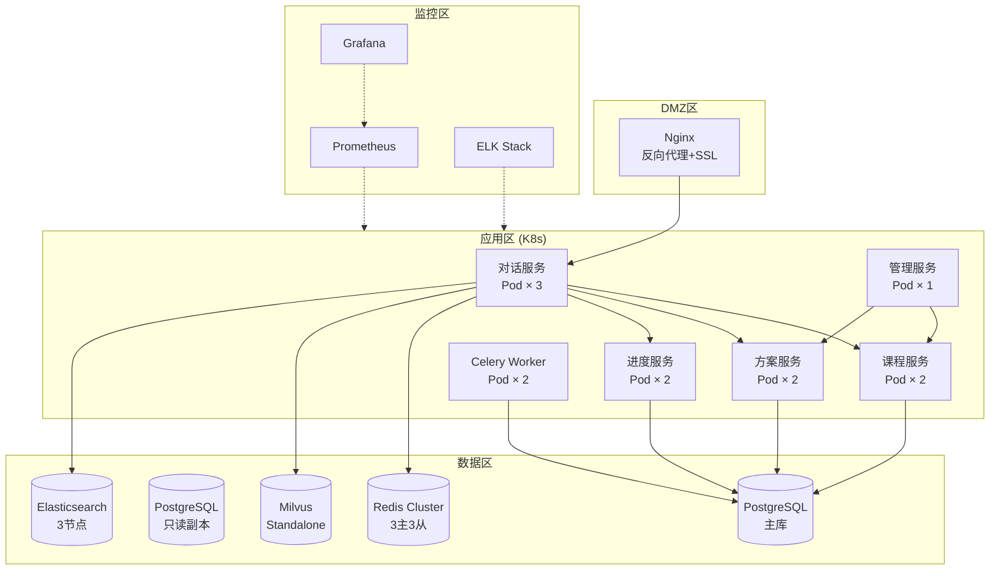

### 8.2 关键中间件配置

| 组件 | 版本 | 资源配置 | 备注 |
|------|------|---------|------|
| PostgreSQL | 16 | 4C 16G, 500G SSD | 开启pgvector扩展 |
| Redis | 7.2 | 每节点2C 4G | Cluster模式 |
| Milvus | 2.4 | 8C 32G, 200G SSD | 单机模式足以支撑初期 |
| Elasticsearch | 8.12 | 每节点4C 8G, 200G SSD | 3节点集群 |
| RabbitMQ | 3.13 | 2C 4G | 消息队列 |

### 8.3 容器化配置

```
project/
├── docker-compose.yml          # 开发环境编排
├── k8s/                        # 生产环境K8s配置
│   ├── namespaces.yaml
│   ├── configmap.yaml
│   ├── secrets.yaml
│   └── deployments/
│       ├── dialog-service.yaml
│       ├── course-service.yaml
│       └── ...
├── services/
│   ├── dialog-service/
│   │   ├── Dockerfile
│   │   └── ...
│   ├── course-service/
│   │   ├── Dockerfile
│   │   └── ...
│   └── ...
└── data/                       # 初始化SQL/迁移脚本
    └── migrations/
```

### 8.4 数据导入与备份策略

系统不连接外部教务系统，数据通过后台管理端导入。

**导入策略**：
- **全量导入**：每学期初由教学秘书导入最新培养方案、课程目录、学生信息
- **增量更新**：学期中通过后台逐条或批量追加成绩、课表变动
- **导入批次管理**：每次导入生成批次ID，支持预览和回滚

**数据备份**：
```
PostgreSQL ──每日全量备份──> 冷存储(保留30天)
                         ──每周归档──> 长期存储(保留1年)
                         ──导入前自动快照──> 回滚点

备份内容: 业务数据 + 向量索引元数据(Milvus collection schema)
恢复流程: 停止服务 → 还原PG → 重建向量索引 → 启动服务
```

**数据一致性保障**：
- 导入操作包裹在事务中，失败自动回滚
- 培养方案中的课程引用须通过外键校验
- 成绩/课表中的学号引用须通过外键校验
- 学期切换时提供数据版本快照，支持历史回溯

### 8.5 监控告警指标

| 类别 | 指标 | 告警阈值 |
|------|------|---------|
| 服务健康 | 服务可用性 | < 99.9% |
| 对话质量 | AI回答置信度均值 | < 0.7 |
| 对话质量 | 人工纠错率 | > 5% |
| 系统性能 | 对话接口P99延迟 | > 3秒 |
| 系统性能 | 数据库连接池使用率 | > 80% |
| 数据管理 | 数据导入任务失败 | 即时告警 |
| LLM | Token消耗异常 | 日环比 > 50% |
| 安全 | 输入过滤器拦截率突增 | 环比 > 200% |

### 8.6 降级与容灾

| 场景 | 降级策略 | 恢复方式 |
|------|---------|---------|
| LLM服务不可用 | 退回规则引擎模式（仅支持事实查询） | 自动重连，人工切换 |
| 向量数据库不可用 | 仅用Elasticsearch做关键词检索 | 从副本恢复 |
| PostgreSQL不可用 | 服务整体降级为维护模式，返回友好提示 | 主从切换，从备份恢复 |
| Redis不可用 | 跳过缓存，直连数据库（限流从严） | Cluster自动故障转移 |

---

## 9. 项目里程碑建议

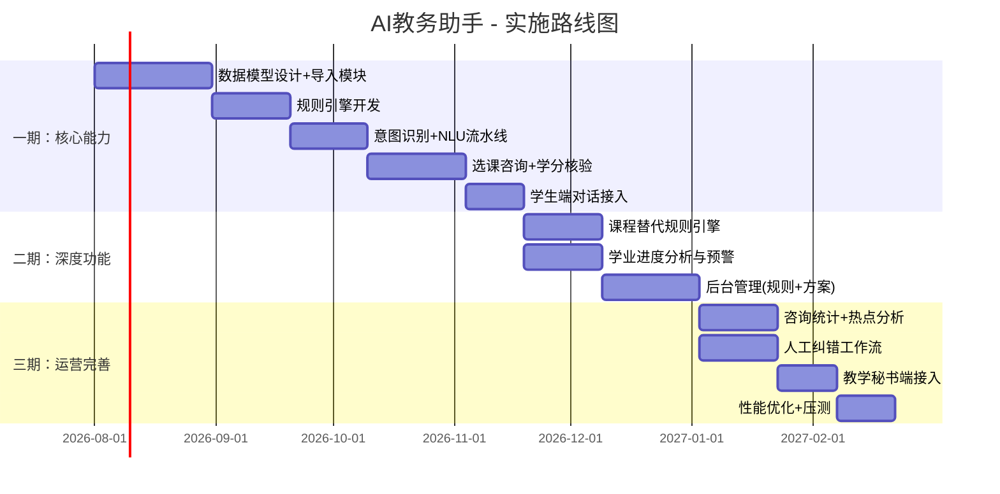

| 阶段 | 时间 | 交付物 | 验收标准 |
|------|------|--------|---------|
| **一期** | 3个月 | 选课咨询+学分核验MVP（含数据导入） | 学生可通过自然语言查询学分、先修条件，回答准确率≥95%，基础数据可Excel导入 |
| **二期** | 2个月 | 进度分析+后台管理 | 学业进度报告准确，教务处可配置规则 |
| **三期** | 2个月 | 数据运营+人工纠错闭环 | 咨询统计面板可用，纠错流程打通 |

---

## 附录

### A. 术语表

| 术语 | 说明 |
|------|------|
| 培养方案 | 学校规定的各专业课程修读计划与学分要求 |
| 先修条件 | 选修某门课程前必须满足的条件（已修课程、学分、年级等） |
| 课程替代 | 用已修课程A替代培养方案中要求的课程B，需满足替代规则 |
| RAG | 检索增强生成，结合信息检索与LLM生成的技术 |
| RRF | 倒数排名融合，多路检索结果合并算法 |

### B. 参考技术文档

- FastAPI官方文档: https://fastapi.tiangolo.com/
- LangChain文档: https://python.langchain.com/
- Milvus向量数据库: https://milvus.io/docs/
- Anthropic Claude API: https://docs.anthropic.com/

---

> **文档结束**  
> *本文档为AI教务助手系统第1版技术方案，后续迭代将根据实际开发反馈持续更新。*
