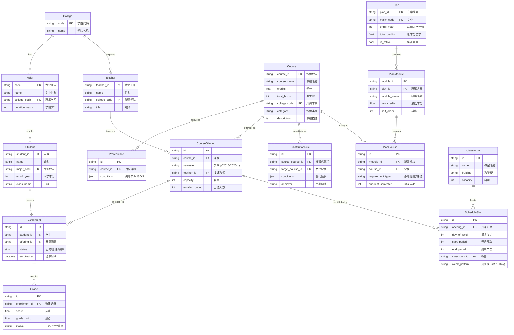
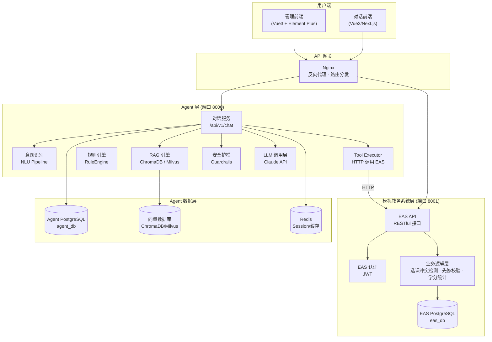
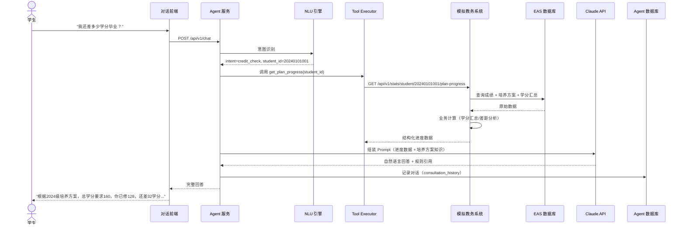
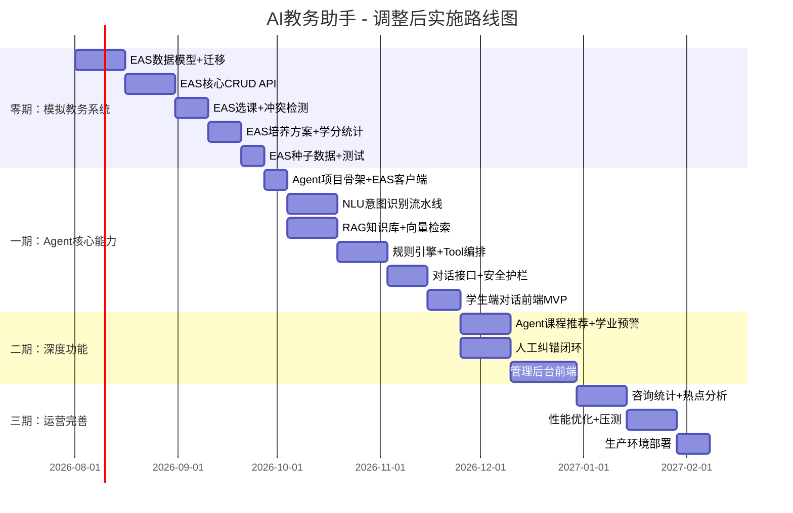

# AI教务助手 - 补充方案：模拟教务系统 + Agent 架构

> **版本**: v1.0
> **日期**: 2026-07-15
> **状态**: 方案设计阶段
> **说明**: 本文档是对《AI教务助手-技术方案.md》的补充，新增"先搭建模拟教务系统，再做 Agent"的架构设计。

---

## 目录

1. [方案变更概述](#1-方案变更概述)
2. [模拟教务系统设计](#2-模拟教务系统设计)
3. [整体架构更新](#3-整体架构更新)
4. [技术选型精炼](#4-技术选型精炼)
5. [Agent 集成方式变更](#5-agent-集成方式变更)
6. [项目结构](#6-项目结构)
7. [开发路线图更新](#7-开发路线图更新)

---

## 1. 方案变更概述

### 1.1 原方案 vs 新方案

```
原方案：
  User → Agent → PostgreSQL（直连数据库）
                  ↑
             Excel 手动导入数据

新方案：
  User → Agent → 模拟教务系统 API → PostgreSQL（教务数据）
                  ↑                      ↑
             LangChain Tools        Admin UI 管理数据
             (HTTP 调用)            (CRUD 操作)
```

### 1.2 为什么要先建模拟教务系统

| 对比维度 | 原方案（纯导入） | 新方案（模拟教务系统） |
|---------|---------------|-------------------|
| **真实感** | Agent 直连数据库，与实际生产架构差距大 | Agent 通过 HTTP API 获取数据，接近真实集成场景 |
| **可替换性** | 换成真实教务系统需重写全部数据访问层 | 模拟教务系统 API 与真实系统 API 对齐后，仅切换 base_url |
| **独立可用** | 数据导入只是后台功能，无法独立演示 | 模拟教务系统本身是一个完整可用的教务管理平台 |
| **开发解耦** | Agent 开发依赖数据库 schema | Agent 仅依赖 API 契约，前后端可并行开发 |
| **测试友好** | 需要构造数据库状态来测试 Agent | 可通过 API 直接构造/清理测试数据 |

### 1.3 核心设计原则

1. **模拟教务系统是独立服务**：拥有自己的数据库、API、认证体系，不依赖 Agent
2. **Agent 通过 HTTP API 访问教务数据**：不直连教务数据库，所有数据通过 API 获取
3. **Agent 保留自有存储**：对话记录、反馈数据、向量索引等 Agent 特有数据存于独立数据库
4. **开发顺序**：先建模拟教务系统 → 再建 Agent → 最后做前端

---

## 2. 模拟教务系统设计

### 2.1 功能边界

模拟教务系统（Educational Administration System，以下简称 EAS）是一个**功能完整但范围可控**的教务管理平台。

**MVP 范围（一期）**：

| 模块 | 功能 | 优先级 |
|------|------|:------:|
| 学籍管理 | 学生信息 CRUD、按学院/专业/年级筛选 | P0 |
| 课程管理 | 课程目录 CRUD、课程描述、学分/学时、开课学期 | P0 |
| 培养方案 | 方案 CRUD、模块结构（通识必修/专业必修/专业选修/实践）、学分要求 | P0 |
| 成绩管理 | 成绩录入/查询、按学生/课程/学期筛选、绩点计算 | P0 |
| 选课管理 | 学生选课/退课、选课冲突检测（时间+先修条件） | P0 |
| 课表管理 | 课程时间安排、教室分配、教师分配 | P0 |
| 先修条件 | 条件表达式配置、自动校验 | P1 |
| 课程替代 | 替代规则配置、条件匹配 | P1 |
| 用户认证 | JWT 登录、角色权限（学生/教师/管理员） | P0 |
| 数据导入 | Excel 批量导入学生/课程/成绩 | P1 |

**不做**：
- 财务/学费模块
- 考试排考
- 毕业审核（留给 Agent 做）
- 对接真实 CAS/LDAP（预留接口即可）

### 2.2 EAS 数据模型



### 2.3 EAS API 设计

#### 2.3.1 接口总览

```
Base URL: http://localhost:8001/api/v1

认证模块:
  POST   /auth/login              登录
  POST   /auth/refresh            刷新Token
  GET    /auth/me                 当前用户信息

学生模块:
  GET    /students                学生列表（分页+筛选）
  GET    /students/{id}           学生详情
  POST   /students                新增学生
  PUT    /students/{id}           更新学生
  DELETE /students/{id}           删除学生

课程模块:
  GET    /courses                 课程列表（分页+搜索）
  GET    /courses/{id}            课程详情
  POST   /courses                 新增课程
  PUT    /courses/{id}            更新课程
  DELETE /courses/{id}            删除课程
  GET    /courses/{id}/prerequisites  查询先修条件
  GET    /courses/{id}/offerings      查询开课记录

成绩模块:
  GET    /grades                  成绩列表（筛选：student_id, course_id, semester）
  GET    /grades/student/{id}     学生全部成绩（含绩点汇总）
  POST   /grades                  录入成绩
  PUT    /grades/{id}             修改成绩

选课模块:
  GET    /enrollments             选课记录（筛选：student_id, semester）
  GET    /enrollments/{id}        选课详情
  POST   /enrollments             选课（含冲突检测）
  DELETE /enrollments/{id}        退课
  GET    /enrollments/student/{id}/schedule  学生课表

培养方案:
  GET    /plans                   方案列表
  GET    /plans/{id}              方案详情（含模块+课程结构）
  POST   /plans                   新增方案
  PUT    /plans/{id}              更新方案
  GET    /plans/match             匹配学生适用的方案

先修条件:
  GET    /prerequisites           条件列表
  POST   /prerequisites           新增条件
  PUT    /prerequisites/{id}      更新条件
  DELETE /prerequisites/{id}      删除条件
  POST   /prerequisites/check     校验学生是否满足某课先修条件

课程替代:
  GET    /substitutions           替代规则列表
  POST   /substitutions           新增规则
  POST   /substitutions/check     校验替代是否成立

统计模块:
  GET    /stats/student/{id}/credits     学生学分汇总
  GET    /stats/student/{id}/gpa         学生GPA
  GET    /stats/student/{id}/plan-progress  培养方案完成进度
  GET    /stats/college/{code}/overview  学院概览统计
```

#### 2.3.2 核心接口示例

**POST /enrollments - 选课（含冲突检测）**

```json
// 请求
{
  "student_id": "20240101001",
  "offering_id": "OFF_CS401_2025FALL"
}

// 响应 - 成功
{
  "code": 0,
  "data": {
    "enrollment_id": "ENR_20260715_001",
    "status": "正常",
    "warnings": []
  }
}

// 响应 - 冲突
{
  "code": 3001,
  "message": "选课冲突",
  "data": {
    "conflicts": [
      {
        "type": "time_conflict",
        "detail": "与已选课程《数据结构》(周二 3-4节)时间冲突",
        "conflicting_course": "CS201"
      },
      {
        "type": "prerequisite_not_met",
        "detail": "先修课程《离散数学》未修读或成绩不合格",
        "required_course": "MATH201"
      }
    ]
  }
}
```

**GET /stats/student/{id}/plan-progress - 培养方案进度**

```json
{
  "code": 0,
  "data": {
    "student_id": "20240101001",
    "plan_id": "PLAN_CS_2024",
    "plan_name": "计算机科学与技术2024级培养方案",
    "total_credits_required": 160,
    "total_credits_earned": 128,
    "completion_rate": 0.80,
    "gpa": 3.2,
    "modules": [
      {"name": "通识必修", "required": 28, "earned": 24, "status": "incomplete",
       "missing": [{"course_id": "ENG104", "course_name": "大学英语IV", "credits": 2}]},
      {"name": "专业必修", "required": 45, "earned": 42, "status": "incomplete",
       "missing": [{"course_id": "CS301", "course_name": "编译原理", "credits": 3}]},
      {"name": "专业选修", "required": 12, "earned": 14, "status": "complete"},
      {"name": "实践环节", "required": 8, "earned": 2, "status": "incomplete"}
    ],
    "risks": [
      {"level": "red", "type": "practice_deficit", "message": "实践环节仅完成25%，严重滞后"}
    ]
  }
}
```

### 2.4 EAS 技术选型

| 层次 | 选型 | 理由 |
|------|------|------|
| **Web 框架** | FastAPI (Python 3.12+) | 与 Agent 技术栈统一，async 高性能，自动 OpenAPI 文档 |
| **ORM** | SQLAlchemy 2.0 (async) | 成熟稳定，异步支持好，与 Alembic 配合 |
| **数据校验** | Pydantic v2 | FastAPI 原生集成，类型安全 |
| **数据库** | PostgreSQL 16 | 业务数据存储，稳定性好 |
| **迁移工具** | Alembic | SQLAlchemy 生态，版本化 schema 管理 |
| **认证** | python-jose + passlib | JWT 签发与验证，bcrypt 密码哈希 |
| **异步任务** | FastAPI BackgroundTasks | 轻量场景无需 Celery，够用 |
| **测试** | pytest + httpx | 异步测试支持，API 测试 |
| **文档** | 自动 OpenAPI (Swagger UI) | FastAPI 自带，零成本 |

**为什么不用 Django？**
- FastAPI 与 Agent 服务技术栈统一，减少上下文切换
- 异步性能更好，适合作为 API 后端
- Pydantic 类型校验与 Agent 端 Tool 定义天然对应

### 2.5 EAS 数据库选型说明

**单数据库方案**：模拟教务系统独占一个 PostgreSQL 数据库（`eas_db`），Agent 服务使用另一个数据库（`agent_db`）。

```
PostgreSQL 16
├── eas_db        # 模拟教务系统数据
│   ├── students
│   ├── courses
│   ├── grades
│   ├── enrollments
│   ├── plans
│   └── ...
│
└── agent_db      # Agent 自有数据
    ├── conversations
    ├── feedback
    ├── consultation_history
    └── ...
```

**为什么分库？**
- 模拟真实场景：Agent 无法直连教务数据库
- 独立演进：两套 schema 可以独立变更
- 权限隔离：Agent 仅通过 API 访问教务数据

---

## 3. 整体架构更新

### 3.1 更新后架构图



### 3.2 请求流转示例



### 3.3 关键架构决策更新

| 决策 | 原方案 | 新方案 | 理由 |
|------|--------|--------|------|
| **数据获取** | Agent 直连 PG 查询 | Agent 调用 EAS API | 模拟真实集成，解耦数据层 |
| **规则引擎** | Agent 内置 | EAS 内置 + Agent 内置 | 确定性计算放 EAS，语义推理放 Agent |
| **数据管理** | Excel 导入 | EAS Admin UI + API | 独立教务系统更完整 |
| **先修检查** | Agent 规则引擎计算 | 调用 EAS API 获取结果 | 业务逻辑归属教务系统 |
| **学分统计** | Agent SQL 查询 | 调用 EAS /stats API | EAS 负责计算，Agent 负责解读 |
| **向量存储** | Milvus 独立部署 | ChromaDB(dev) / Milvus(prod) | 降低开发环境复杂度 |

---

## 4. 技术选型精炼

### 4.1 全栈技术选型对比

| 层次 | 组件 | 开发环境 | 生产环境 | 说明 |
|------|------|---------|---------|------|
| **后端框架** | FastAPI | ✓ | ✓ | EAS 和 Agent 统一使用 |
| **ORM** | SQLAlchemy 2.0 async | ✓ | ✓ | |
| **数据库** | PostgreSQL 16 | ✓ | ✓ | EAS 和 Agent 各一个 DB |
| **向量数据库** | ChromaDB | ✓ | - | 嵌入式，零运维 |
| **向量数据库** | Milvus | - | ✓ | 高性能 ANN 检索 |
| **缓存** | Redis 7 | ✓ | ✓ | |
| **LLM** | Claude Sonnet 4.6 | ✓ | ✓ | 性价比最优 |
| **LLM 框架** | LangChain + LangGraph | ✓ | ✓ | Agent 编排 |
| **Embedding** | text2vec-large-chinese | ✓ | ✓ | 本地部署，免费 |
| **容器** | Docker Compose | ✓ | - | 一键启动全部服务 |
| **容器编排** | Kubernetes | - | ✓ | 生产环境 |
| **反向代理** | Nginx | ✓ | ✓ | 路由分发 + SSL |
| **前端** | Vue 3 + Element Plus | ✓ | ✓ | 管理后台 |
| **前端** | Vue 3 / Next.js | ✓ | ✓ | 对话前端 |

### 4.2 简化策略（相比原方案）

原方案基础设施组件：PostgreSQL + Milvus + Elasticsearch + Redis + Celery + RabbitMQ + Prometheus + Grafana + ELK = **9 个组件**

新方案开发环境组件：PostgreSQL + ChromaDB + Redis + Nginx = **4 个组件**

| 原组件 | 新方案处理 | 理由 |
|--------|-----------|------|
| Milvus | → ChromaDB（开发）/ Milvus（生产） | ChromaDB 嵌入式部署，开发零配置 |
| Elasticsearch | → PostgreSQL `tsvector` + pgvector | PG 内置全文搜索足以覆盖课程搜索场景 |
| Celery | → FastAPI BackgroundTasks | 异步任务量小，无需独立消息队列 |
| RabbitMQ | → 去掉 | 同上 |
| Prometheus + Grafana | → 生产再加 | 开发阶段看日志即可 |
| ELK | → 生产再加 | 开发阶段用 PG 日志表替代 |

### 4.3 LLM 选型

| 场景 | 模型选择 | 理由 |
|------|---------|------|
| **日常对话/咨询** | Claude Sonnet 4.6 | 性价比最优，响应快 |
| **复杂推理/方案解读** | Claude Opus 4.7 | 复杂培养方案条款推理 |
| **意图识别（方案一）** | 本地 BERT 微调 | 低延迟，离线可用，成本低 |
| **意图识别（方案二）** | Claude Haiku 4.5 | 开发快，准确率高，按量付费 |
| **Embedding** | text2vec-large-chinese | 本地部署，中文语义效果好 |

> **建议**：意图识别先用 Claude Haiku（开发快），上线后根据调用量决定是否切换本地模型。

### 4.4 开发环境一键部署

```yaml
# docker-compose.yml 服务列表
services:
  nginx:        # 反向代理，路由分发到 EAS + Agent
  eas_api:      # 模拟教务系统 (FastAPI, port 8001)
  agent_api:    # AI 教务助手 (FastAPI, port 8000)
  eas_db:       # PostgreSQL 16 (eas_db)
  agent_db:     # PostgreSQL 16 (agent_db)
  redis:        # Redis 7
  chromadb:     # ChromaDB (可选，也可嵌入 Agent 进程)
```

开发者只需 `docker compose up -d`，6 个容器启动后即可拥有完整环境。

---

## 5. Agent 集成方式变更

### 5.1 Tool 定义变更

原方案中 Agent 的 Tool 直连数据库查询，新方案中所有 Tool 改为 HTTP 调用 EAS API：

```python
# 原方案：Tool 直连数据库
def get_student_grades(student_id: str):
    db = get_db_session()
    return db.query(Grade).filter_by(student_id=student_id).all()

# 新方案：Tool 调用 EAS API
def get_student_grades(student_id: str):
    response = httpx.get(
        f"{EAS_BASE_URL}/api/v1/grades/student/{student_id}",
        headers={"Authorization": f"Bearer {EAS_SERVICE_TOKEN}"}
    )
    return response.json()["data"]
```

### 5.2 Agent 工具清单

```python
AGENT_TOOLS = [
    {
        "name": "get_student_info",
        "endpoint": "GET /students/{student_id}",
        "description": "获取学生基本信息（专业、年级、入学年份）"
    },
    {
        "name": "get_student_grades",
        "endpoint": "GET /grades/student/{student_id}",
        "description": "获取学生全部成绩记录"
    },
    {
        "name": "get_student_schedule",
        "endpoint": "GET /enrollments/student/{student_id}/schedule",
        "description": "获取学生当前学期课表"
    },
    {
        "name": "get_course_info",
        "endpoint": "GET /courses/{course_id}",
        "description": "获取课程详情（学分、描述、开课学期）"
    },
    {
        "name": "get_course_prerequisites",
        "endpoint": "GET /courses/{course_id}/prerequisites",
        "description": "查询课程的先修条件"
    },
    {
        "name": "check_prerequisite",
        "endpoint": "POST /prerequisites/check",
        "description": "校验学生是否满足某课程先修条件"
    },
    {
        "name": "get_plan_progress",
        "endpoint": "GET /stats/student/{student_id}/plan-progress",
        "description": "获取学生培养方案完成进度与差距"
    },
    {
        "name": "get_student_gpa",
        "endpoint": "GET /stats/student/{student_id}/gpa",
        "description": "获取学生累计GPA及各学期绩点趋势"
    },
    {
        "name": "search_courses",
        "endpoint": "GET /courses?keyword=xxx&category=xxx",
        "description": "按关键词/类别搜索课程目录"
    },
    {
        "name": "check_substitution",
        "endpoint": "POST /substitutions/check",
        "description": "校验课程A是否能替代课程B"
    },
    {
        "name": "check_enrollment_conflict",
        "endpoint": "POST /enrollments（返回冲突信息）",
        "description": "检测选课是否与已有课表冲突"
    },
    {
        "name": "get_matching_plan",
        "endpoint": "GET /plans/match?student_id=xxx",
        "description": "获取匹配学生专业的培养方案"
    }
]
```

### 5.3 Agent 自有数据

Agent 不存储教务数据，但维护以下自有数据：

| 数据类型 | 存储位置 | 用途 |
|---------|---------|------|
| 对话记录 | agent_db.conversations | 多轮对话上下文、历史回溯 |
| 用户反馈 | agent_db.feedback | 纠错记录、满意度统计 |
| 知识库向量 | ChromaDB / Milvus | 培养方案条款、规章制度语义检索 |
| FAQ 向量 | ChromaDB / Milvus | 常见问题快速匹配 |
| Session 缓存 | Redis | 对话上下文缓存、热点数据 |
| 用户账号 | agent_db.users | Agent 端独立账号（可与 EAS 账号映射） |

---

## 6. 项目结构

```
academic_assistant/
├── docker-compose.yml                # 开发环境一键部署
├── docker-compose.prod.yml           # 生产环境配置
├── .env.example                      # 环境变量模板
├── README.md
│
├── docs/
│   ├── AI教务助手-技术方案.md         # 原始技术方案
│   └── AI教务助手-补充方案-模拟教务系统.md  # 本文档
│
├── services/
│   ├── eas/                          # 模拟教务系统 (Educational Administration System)
│   │   ├── Dockerfile
│   │   ├── requirements.txt
│   │   ├── alembic.ini
│   │   ├── app/
│   │   │   ├── main.py               # FastAPI 应用入口
│   │   │   ├── config.py             # 配置管理
│   │   │   ├── database.py           # 数据库连接
│   │   │   ├── dependencies.py       # 依赖注入
│   │   │   ├── models/               # SQLAlchemy ORM 模型
│   │   │   │   ├── __init__.py
│   │   │   │   ├── college.py
│   │   │   │   ├── major.py
│   │   │   │   ├── student.py
│   │   │   │   ├── teacher.py
│   │   │   │   ├── course.py
│   │   │   │   ├── plan.py
│   │   │   │   ├── enrollment.py
│   │   │   │   ├── grade.py
│   │   │   │   └── schedule.py
│   │   │   ├── schemas/              # Pydantic 请求/响应模型
│   │   │   ├── api/                  # API 路由
│   │   │   │   ├── __init__.py
│   │   │   │   ├── auth.py
│   │   │   │   ├── students.py
│   │   │   │   ├── courses.py
│   │   │   │   ├── grades.py
│   │   │   │   ├── enrollments.py
│   │   │   │   ├── plans.py
│   │   │   │   ├── prerequisites.py
│   │   │   │   ├── substitutions.py
│   │   │   │   └── stats.py
│   │   │   └── services/             # 业务逻辑
│   │   │       ├── enrollment_service.py    # 选课+冲突检测
│   │   │       ├── prerequisite_service.py  # 先修条件校验
│   │   │       ├── plan_service.py          # 培养方案匹配
│   │   │       ├── stats_service.py         # 统计计算
│   │   │       └── substitution_service.py  # 课程替代
│   │   ├── migrations/               # Alembic 迁移脚本
│   │   └── tests/
│   │
│   ├── agent/                        # AI 教务助手 Agent
│   │   ├── Dockerfile
│   │   ├── requirements.txt
│   │   ├── app/
│   │   │   ├── main.py               # FastAPI 应用入口
│   │   │   ├── config.py             # 配置管理（含 EAS_BASE_URL）
│   │   │   ├── api/
│   │   │   │   ├── chat.py           # 对话接口
│   │   │   │   ├── feedback.py       # 反馈接口
│   │   │   │   └── admin.py          # Agent 管理接口
│   │   │   ├── engine/
│   │   │   │   └── rule_engine.py    # Agent 侧规则引擎（语义推理）
│   │   │   ├── nlu/
│   │   │   │   ├── intent.py         # 意图识别
│   │   │   │   └── entity.py         # 实体抽取
│   │   │   ├── rag/
│   │   │   │   ├── retriever.py      # 多路检索
│   │   │   │   ├── embeddings.py     # 向量化
│   │   │   │   └── knowledge_base.py # 知识库管理
│   │   │   ├── llm/
│   │   │   │   ├── claude_client.py  # Claude API 封装
│   │   │   │   ├── prompts.py        # Prompt 模板
│   │   │   │   └── orchestrator.py   # LangGraph 编排
│   │   │   ├── tools/
│   │   │   │   ├── __init__.py
│   │   │   │   ├── eas_client.py     # EAS API HTTP 客户端
│   │   │   │   └── definitions.py    # Tool 定义（Function Calling）
│   │   │   └── guardrails/
│   │   │       ├── input_filter.py   # 输入安全过滤
│   │   │       └── output_filter.py  # 输出安全过滤+规则校验
│   │   └── tests/
│   │
│   └── frontend/                     # 前端（可选，初期可用 Swagger UI）
│       ├── chat-ui/                  # 对话前端 (Vue 3 / Next.js)
│       └── admin-ui/                 # 管理后台 (Vue 3 + Element Plus)
│
├── scripts/
│   ├── seed_eas.py                   # EAS 种子数据：学院/专业/课程/学生/方案
│   ├── seed_agent.py                 # Agent 种子数据：FAQ/知识库向量
│   └── dev_setup.sh                  # 开发环境初始化脚本
│
└── nginx/
    └── nginx.conf                    # 开发环境 Nginx 配置
```

---

## 7. 开发路线图更新

### 7.1 调整后的里程碑



### 7.2 阶段里程碑

| 阶段 | 时间 | 核心交付 | 验收标准 |
|------|------|---------|---------|
| **零期：EAS** | 8 周 | 模拟教务系统 + API + 种子数据 | 全部 API 可用，Swagger 文档完整，种子数据覆盖 3 学院 6 专业 200 课程 |
| **一期：Agent MVP** | 8 周 | 选课咨询 + 学分核验 + 对话前端 | 学生可通过自然语言查询学分、先修条件，回答准确率 ≥ 95% |
| **二期：深度功能** | 6 周 | 课程推荐 + 学业预警 + 纠错闭环 + 管理后台 | 学业进度报告可生成，纠错流程打通 |
| **三期：运营完善** | 5 周 | 统计面板 + 优化 + 生产部署 | 全功能上线 |

**总计：约 6.5 个月（零期+一期约 4 个月可出 MVP）**

### 7.3 EAS 种子数据规格

用于开发和演示的模拟数据：

| 实体 | 数量 | 说明 |
|------|:----:|------|
| 学院 | 3 | 计算机学院、数学学院、外国语学院 |
| 专业 | 6 | 每学院 2 个专业 |
| 教师 | 30 | 每学院 10 人 |
| 课程 | 200 | 含课程描述（用于 RAG 检索） |
| 学生 | 100 | 覆盖 3 个年级 |
| 培养方案 | 6 | 每专业 1 份（2024 级） |
| 先修条件 | 40 | 关键课程 |
| 替代规则 | 10 | 典型替代场景 |
| 选课记录 | ~500 | 每学生 5 门 |
| 成绩记录 | ~500 | 与选课对应 |

---

## 附录：与原方案的差异总结

| 维度 | 原方案 | 新方案 |
|------|--------|--------|
| **教务数据来源** | Excel 导入 → Agent 直连 DB | 模拟教务系统 API |
| **数据管理** | Agent 后台管理页 | 模拟教务系统独立管理 |
| **Agent 数据获取** | SQL 直查 | HTTP API 调用 (Tool) |
| **规则执行位置** | Agent 内置 RuleEngine | EAS（确定性计算）+ Agent（语义推理） |
| **开发顺序** | Agent 先行 | EAS 先行 → Agent 对接 |
| **基础设施** | 9 个组件 | 4 个组件（开发环境） |
| **与真实系统对接** | 需重写数据访问层 | 仅切换 EAS base_url |
| **可独立演示** | Agent 无法脱离数据库 | EAS 和 Agent 均可独立演示 |

---

> **文档结束**
> *本文档补充了模拟教务系统的完整设计，以及由此带来的架构、技术选型和开发路线的调整。建议与《AI教务助手-技术方案.md》配合阅读。*
