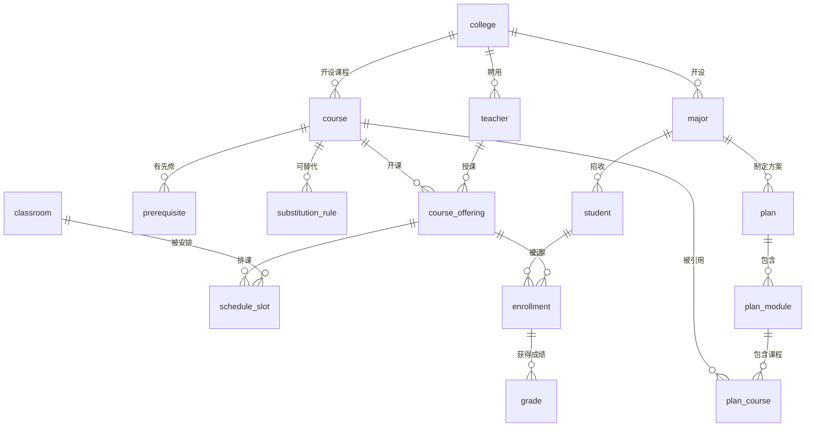

# 模拟教务系统 - 数据库设计文档

> **版本**: v1.0
> **日期**: 2026-07-15
> **数据库**: PostgreSQL 16
> **ORM**: SQLAlchemy 2.0 + Alembic
> **编码**: UTF-8

---

## 目录

1. [概述](#1-概述)
2. [ER 图](#2-er-图)
3. [基础数据表](#3-基础数据表)
4. [教务核心表](#4-教务核心表)
5. [选课与成绩表](#5-选课与成绩表)
6. [培养方案表](#6-培养方案表)
7. [课表排课表](#7-课表排课表)
8. [系统辅助表](#8-系统辅助表)
9. [索引设计](#9-索引设计)
10. [种子数据规格](#10-种子数据规格)
11. [迁移策略](#11-迁移策略)

---

## 1. 概述

### 1.1 数据库命名规范

| 规范项 | 规则 | 示例 |
|--------|------|------|
| 数据库名 | 小写 + 下划线 | `eas_db` |
| 表名 | 小写 + 下划线，单数 | `student`, `course` |
| 主键 | `id` (UUIDv4 字符串) 或业务编号 | `student_id`, `course_id` |
| 外键 | `{referenced_table}_id` | `major_code`, `course_id` |
| 索引 | `ix_{table}_{column}` | `ix_student_major_code` |
| 唯一约束 | `uq_{table}_{column}` | `uq_student_student_id` |
| 时间戳 | `created_at`, `updated_at` (UTC) | |
| JSON 字段 | `{name}_json` 或直接描述性名称 | `conditions`, `time_slots` |
| 布尔字段 | `is_{adjective}` | `is_active`, `is_special` |

### 1.2 Schema 组织

```
eas_db
├── public (默认 schema，所有业务表)
│   ├── 基础数据: college, major, student, teacher
│   ├── 课程体系: course, prerequisite, substitution_rule
│   ├── 培养方案: plan, plan_module, plan_course
│   ├── 选课排课: course_offering, classroom, schedule_slot, enrollment, grade
│   └── 系统辅助: semester, user, import_batch, audit_log
└── 扩展预留
    ├── pgvector 向量检索扩展
    └── 自定义函数与触发器
```

---

## 2. ER 图



---

## 3. 基础数据表

### 3.1 college (学院)

| 字段 | 类型 | 约束 | 说明 |
|------|------|------|------|
| `code` | VARCHAR(10) | **PK** | 学院代码，如 `CS`, `MATH` |
| `name` | VARCHAR(100) | NOT NULL, UNIQUE | 学院全称，如"计算机科学与技术学院" |
| `short_name` | VARCHAR(20) | | 简称，如"计算机学院" |
| `created_at` | TIMESTAMPTZ | NOT NULL, DEFAULT NOW() | |

```sql
CREATE TABLE college (
    code        VARCHAR(10)  PRIMARY KEY,
    name        VARCHAR(100) NOT NULL,
    short_name  VARCHAR(20),
    created_at  TIMESTAMPTZ  NOT NULL DEFAULT NOW(),
    CONSTRAINT uq_college_name UNIQUE (name)
);
```

### 3.2 major (专业)

| 字段 | 类型 | 约束 | 说明 |
|------|------|------|------|
| `code` | VARCHAR(15) | **PK** | 专业代码，如 `CS`, `MATH_AM` |
| `name` | VARCHAR(100) | NOT NULL, UNIQUE | 专业名称，如"计算机科学与技术" |
| `college_code` | VARCHAR(10) | NOT NULL, **FK→college** | 所属学院 |
| `degree` | VARCHAR(10) | NOT NULL, DEFAULT '工学' | 学位类别 |
| `duration_years` | SMALLINT | NOT NULL, DEFAULT 4 | 学制（年） |
| `is_active` | BOOLEAN | NOT NULL, DEFAULT TRUE | 是否在招 |

```sql
CREATE TABLE major (
    code            VARCHAR(15)  PRIMARY KEY,
    name            VARCHAR(100) NOT NULL,
    college_code    VARCHAR(10)  NOT NULL REFERENCES college(code),
    degree          VARCHAR(10)  NOT NULL DEFAULT '工学',
    duration_years  SMALLINT     NOT NULL DEFAULT 4,
    is_active       BOOLEAN      NOT NULL DEFAULT TRUE,
    CONSTRAINT uq_major_name UNIQUE (name)
);
```

### 3.3 student (学生)

| 字段 | 类型 | 约束 | 说明 |
|------|------|------|------|
| `student_id` | VARCHAR(20) | **PK** | 学号，如 `20240101001` |
| `name` | VARCHAR(50) | NOT NULL | 姓名 |
| `gender` | CHAR(1) | CHECK IN ('M','F') | 性别 |
| `major_code` | VARCHAR(15) | NOT NULL, **FK→major** | 专业代码 |
| `enroll_year` | SMALLINT | NOT NULL | 入学年份 |
| `class_name` | VARCHAR(30) | | 班级，如"计科2401" |
| `grade_level` | SMALLINT | NOT NULL | 当前年级（1-5） |
| `status` | VARCHAR(10) | NOT NULL, DEFAULT '在读' | 学籍状态：在读/休学/退学/毕业 |
| `created_at` | TIMESTAMPTZ | NOT NULL, DEFAULT NOW() | |
| `updated_at` | TIMESTAMPTZ | NOT NULL, DEFAULT NOW() | |

```sql
CREATE TABLE student (
    student_id   VARCHAR(20)  PRIMARY KEY,
    name         VARCHAR(50)  NOT NULL,
    gender       CHAR(1)      CHECK (gender IN ('M', 'F')),
    major_code   VARCHAR(15)  NOT NULL REFERENCES major(code),
    enroll_year  SMALLINT     NOT NULL,
    class_name   VARCHAR(30),
    grade_level  SMALLINT     NOT NULL DEFAULT 1,
    status       VARCHAR(10)  NOT NULL DEFAULT '在读',
    created_at   TIMESTAMPTZ  NOT NULL DEFAULT NOW(),
    updated_at   TIMESTAMPTZ  NOT NULL DEFAULT NOW()
);
```

### 3.4 teacher (教师)

| 字段 | 类型 | 约束 | 说明 |
|------|------|------|------|
| `teacher_id` | VARCHAR(20) | **PK** | 教师工号 |
| `name` | VARCHAR(50) | NOT NULL | 姓名 |
| `gender` | CHAR(1) | CHECK IN ('M','F') | 性别 |
| `college_code` | VARCHAR(10) | NOT NULL, **FK→college** | 所属学院 |
| `title` | VARCHAR(20) | DEFAULT '讲师' | 职称：教授/副教授/讲师/助教 |
| `email` | VARCHAR(100) | | 邮箱 |
| `phone` | VARCHAR(20) | | 电话 |
| `created_at` | TIMESTAMPTZ | NOT NULL, DEFAULT NOW() | |

```sql
CREATE TABLE teacher (
    teacher_id   VARCHAR(20)  PRIMARY KEY,
    name         VARCHAR(50)  NOT NULL,
    gender       CHAR(1)      CHECK (gender IN ('M', 'F')),
    college_code VARCHAR(10)  NOT NULL REFERENCES college(code),
    title        VARCHAR(20)  DEFAULT '讲师',
    email        VARCHAR(100),
    phone        VARCHAR(20),
    created_at   TIMESTAMPTZ  NOT NULL DEFAULT NOW()
);
```

---

## 4. 教务核心表

### 4.1 course (课程目录)

| 字段 | 类型 | 约束 | 说明 |
|------|------|------|------|
| `course_id` | VARCHAR(15) | **PK** | 课程代码，如 `CS201` |
| `course_name` | VARCHAR(100) | NOT NULL | 课程名称 |
| `credits` | NUMERIC(3,1) | NOT NULL, CHECK(0.5~20) | 学分 |
| `total_hours` | SMALLINT | NOT NULL | 总学时 |
| `college_code` | VARCHAR(10) | NOT NULL, **FK→college** | 开课学院 |
| `category` | VARCHAR(20) | NOT NULL | 课程类别：通识必修/通识选修/专业必修/专业选修/实践环节 |
| `nature` | VARCHAR(10) | DEFAULT '理论' | 课程性质：理论/实验/实践/理论+实验 |
| `semester_offered` | VARCHAR(5) | | 开课学期：春/秋/春秋 |
| `description` | TEXT | | 课程描述（RAG检索原文） |
| `syllabus_url` | VARCHAR(500) | | 教学大纲链接 |
| `is_active` | BOOLEAN | NOT NULL, DEFAULT TRUE | 是否在开 |
| `created_at` | TIMESTAMPTZ | NOT NULL, DEFAULT NOW() | |
| `updated_at` | TIMESTAMPTZ | NOT NULL, DEFAULT NOW() | |

```sql
CREATE TABLE course (
    course_id        VARCHAR(15)   PRIMARY KEY,
    course_name      VARCHAR(100)  NOT NULL,
    credits          NUMERIC(3,1)  NOT NULL CHECK (credits >= 0.5 AND credits <= 20),
    total_hours      SMALLINT      NOT NULL,
    college_code     VARCHAR(10)   NOT NULL REFERENCES college(code),
    category         VARCHAR(20)   NOT NULL,
    nature           VARCHAR(10)   DEFAULT '理论',
    semester_offered VARCHAR(5),
    description      TEXT,
    syllabus_url     VARCHAR(500),
    is_active        BOOLEAN       NOT NULL DEFAULT TRUE,
    created_at       TIMESTAMPTZ   NOT NULL DEFAULT NOW(),
    updated_at       TIMESTAMPTZ   NOT NULL DEFAULT NOW()
);
```

### 4.2 prerequisite (先修条件)

| 字段 | 类型 | 约束 | 说明 |
|------|------|------|------|
| `id` | UUID | **PK** | |
| `course_id` | VARCHAR(15) | NOT NULL, **FK→course** | 目标课程 |
| `conditions` | JSONB | NOT NULL | 条件表达式（见下方结构） |
| `rule_source` | VARCHAR(200) | | 规则来源（如"2024培养方案"） |
| `is_active` | BOOLEAN | NOT NULL, DEFAULT TRUE | |
| `created_at` | TIMESTAMPTZ | NOT NULL, DEFAULT NOW() | |
| `updated_at` | TIMESTAMPTZ | NOT NULL, DEFAULT NOW() | |

```sql
CREATE TABLE prerequisite (
    id           UUID          PRIMARY KEY DEFAULT gen_random_uuid(),
    course_id    VARCHAR(15)   NOT NULL REFERENCES course(course_id) ON DELETE CASCADE,
    conditions   JSONB         NOT NULL,
    rule_source  VARCHAR(200),
    is_active    BOOLEAN       NOT NULL DEFAULT TRUE,
    created_at   TIMESTAMPTZ   NOT NULL DEFAULT NOW(),
    updated_at   TIMESTAMPTZ   NOT NULL DEFAULT NOW(),
    CONSTRAINT uq_prerequisite_course UNIQUE (course_id)
);
```

**conditions JSONB 结构**：

```json
{
  "logic": "AND",
  "conditions": [
    {
      "type": "course",
      "course_id": "CS101",
      "course_name": "程序设计基础",
      "min_score": 60
    },
    {
      "type": "course",
      "course_id": "MATH101",
      "course_name": "高等数学I",
      "min_score": 60
    },
    {
      "type": "credit",
      "min_credits": 40
    },
    {
      "type": "grade_level",
      "min": 2
    }
  ]
}
```

支持的条件类型：

| type | 说明 | 关键字段 |
|------|------|---------|
| `course` | 须修读指定课程 | `course_id`, `min_score` |
| `course_group` | 从课程组中选N门 | `course_ids[]`, `min_count` |
| `credit` | 须修满指定学分 | `min_credits` |
| `grade_level` | 年级限制 | `min`, `max` |
| `major` | 专业限制 | `major_codes[]` |
| `composite` | 嵌套复合条件 | `logic`, `conditions[]` |

### 4.3 substitution_rule (课程替代规则)

| 字段 | 类型 | 约束 | 说明 |
|------|------|------|------|
| `id` | UUID | **PK** | |
| `source_course_id` | VARCHAR(15) | NOT NULL, **FK→course** | 被替代课程 |
| `target_course_id` | VARCHAR(15) | NOT NULL, **FK→course** | 替代课程 |
| `conditions` | JSONB | | 替代条件（成绩下限、审批要求等） |
| `approver` | VARCHAR(30) | | 审批层级：无需审批/学院审批/教务处审批 |
| `rule_source` | VARCHAR(200) | | 依据文件 |
| `is_active` | BOOLEAN | NOT NULL, DEFAULT TRUE | |
| `created_at` | TIMESTAMPTZ | NOT NULL, DEFAULT NOW() | |
| `updated_at` | TIMESTAMPTZ | NOT NULL, DEFAULT NOW() | |

```sql
CREATE TABLE substitution_rule (
    id                UUID         PRIMARY KEY DEFAULT gen_random_uuid(),
    source_course_id  VARCHAR(15)  NOT NULL REFERENCES course(course_id),
    target_course_id  VARCHAR(15)  NOT NULL REFERENCES course(course_id),
    conditions        JSONB,
    approver          VARCHAR(30)  DEFAULT '学院审批',
    rule_source       VARCHAR(200),
    is_active         BOOLEAN      NOT NULL DEFAULT TRUE,
    created_at        TIMESTAMPTZ  NOT NULL DEFAULT NOW(),
    updated_at        TIMESTAMPTZ  NOT NULL DEFAULT NOW(),
    CONSTRAINT chk_sub_diff CHECK (source_course_id <> target_course_id)
);
```

**conditions JSONB 示例**：

```json
{
  "min_score": 75,
  "max_valid_years": 5,
  "note": "2019级及以前培养方案中的旧课程代码，内容实质等价"
}
```

---

## 5. 选课与成绩表

### 5.1 semester (学期)

| 字段 | 类型 | 约束 | 说明 |
|------|------|------|------|
| `code` | VARCHAR(15) | **PK** | 学期代码，如 `2025-2026-1` |
| `name` | VARCHAR(30) | NOT NULL | 显示名称，如"2025-2026学年第1学期" |
| `academic_year` | VARCHAR(9) | NOT NULL | 学年，如 `2025-2026` |
| `term` | SMALLINT | NOT NULL | 学期序号：1=秋, 2=春, 3=暑 |
| `start_date` | DATE | | 学期开始日期 |
| `end_date` | DATE | | 学期结束日期 |
| `is_current` | BOOLEAN | NOT NULL, DEFAULT FALSE | 是否当前学期 |

```sql
CREATE TABLE semester (
    code          VARCHAR(15)  PRIMARY KEY,
    name          VARCHAR(30)  NOT NULL,
    academic_year VARCHAR(9)   NOT NULL,
    term          SMALLINT     NOT NULL CHECK (term IN (1, 2, 3)),
    start_date    DATE,
    end_date      DATE,
    is_current    BOOLEAN      NOT NULL DEFAULT FALSE
);
```

### 5.2 course_offering (开课记录)

每次开课是一条记录，同一门课不同学期有独立开课记录。

| 字段 | 类型 | 约束 | 说明 |
|------|------|------|------|
| `id` | UUID | **PK** | |
| `course_id` | VARCHAR(15) | NOT NULL, **FK→course** | 课程 |
| `semester` | VARCHAR(15) | NOT NULL, **FK→semester** | 开课学期 |
| `teacher_id` | VARCHAR(20) | NOT NULL, **FK→teacher** | 授课教师 |
| `class_no` | VARCHAR(5) | DEFAULT '01' | 课序号（同一门课多个平行班） |
| `capacity` | SMALLINT | NOT NULL, CHECK(≥0) | 选课容量 |
| `enrolled_count` | SMALLINT | NOT NULL, DEFAULT 0 | 已选人数 |
| `language` | VARCHAR(10) | DEFAULT '中文' | 授课语言 |
| `note` | VARCHAR(200) | | 备注 |
| `created_at` | TIMESTAMPTZ | NOT NULL, DEFAULT NOW() | |

```sql
CREATE TABLE course_offering (
    id             UUID         PRIMARY KEY DEFAULT gen_random_uuid(),
    course_id      VARCHAR(15)  NOT NULL REFERENCES course(course_id),
    semester       VARCHAR(15)  NOT NULL REFERENCES semester(code),
    teacher_id     VARCHAR(20)  NOT NULL REFERENCES teacher(teacher_id),
    class_no       VARCHAR(5)   DEFAULT '01',
    capacity       SMALLINT     NOT NULL CHECK (capacity >= 0),
    enrolled_count SMALLINT     NOT NULL DEFAULT 0,
    language       VARCHAR(10)  DEFAULT '中文',
    note           VARCHAR(200),
    created_at     TIMESTAMPTZ  NOT NULL DEFAULT NOW(),
    CONSTRAINT uq_offering UNIQUE (course_id, semester, class_no)
);
```

### 5.3 enrollment (选课记录)

| 字段 | 类型 | 约束 | 说明 |
|------|------|------|------|
| `id` | UUID | **PK** | |
| `student_id` | VARCHAR(20) | NOT NULL, **FK→student** | 学生学号 |
| `offering_id` | UUID | NOT NULL, **FK→course_offering** | 开课记录 |
| `status` | VARCHAR(10) | NOT NULL, DEFAULT '正常' | 状态：正常/退课/等待/落选 |
| `enrolled_at` | TIMESTAMPTZ | NOT NULL, DEFAULT NOW() | 选课时间 |
| `updated_at` | TIMESTAMPTZ | NOT NULL, DEFAULT NOW() | |

```sql
CREATE TABLE enrollment (
    id           UUID         PRIMARY KEY DEFAULT gen_random_uuid(),
    student_id   VARCHAR(20)  NOT NULL REFERENCES student(student_id),
    offering_id  UUID         NOT NULL REFERENCES course_offering(id),
    status       VARCHAR(10)  NOT NULL DEFAULT '正常',
    enrolled_at  TIMESTAMPTZ  NOT NULL DEFAULT NOW(),
    updated_at   TIMESTAMPTZ  NOT NULL DEFAULT NOW(),
    CONSTRAINT uq_enrollment UNIQUE (student_id, offering_id)
);
```

### 5.4 grade (成绩)

| 字段 | 类型 | 约束 | 说明 |
|------|------|------|------|
| `id` | UUID | **PK** | |
| `enrollment_id` | UUID | NOT NULL, UNIQUE, **FK→enrollment** | 选课记录（一对一） |
| `score` | NUMERIC(5,1) | CHECK(0~100) | 总评分数 |
| `usual_score` | NUMERIC(5,1) | CHECK(0~100) | 平时成绩 |
| `exam_score` | NUMERIC(5,1) | CHECK(0~100) | 考试成绩 |
| `grade_point` | NUMERIC(3,1) | | 绩点（如 4.0 / 3.7 / 3.3 ...） |
| `status` | VARCHAR(10) | NOT NULL, DEFAULT '正常' | 状态：正常/补考/重修/缓考 |
| `entered_by` | VARCHAR(20) | | 录入人工号 |
| `entered_at` | TIMESTAMPTZ | NOT NULL, DEFAULT NOW() | |
| `updated_at` | TIMESTAMPTZ | NOT NULL, DEFAULT NOW() | |

```sql
CREATE TABLE grade (
    id             UUID         PRIMARY KEY DEFAULT gen_random_uuid(),
    enrollment_id  UUID         NOT NULL UNIQUE REFERENCES enrollment(id),
    score          NUMERIC(5,1) CHECK (score >= 0 AND score <= 100),
    usual_score    NUMERIC(5,1) CHECK (usual_score >= 0 AND usual_score <= 100),
    exam_score     NUMERIC(5,1) CHECK (exam_score >= 0 AND exam_score <= 100),
    grade_point    NUMERIC(3,1),
    status         VARCHAR(10)  NOT NULL DEFAULT '正常',
    entered_by     VARCHAR(20),
    entered_at     TIMESTAMPTZ  NOT NULL DEFAULT NOW(),
    updated_at     TIMESTAMPTZ  NOT NULL DEFAULT NOW()
);
```

**绩点换算规则（可在应用层计算）**：

| 百分制 | 绩点 |
|:------:|:----:|
| 90-100 | 4.0 |
| 85-89 | 3.7 |
| 82-84 | 3.3 |
| 78-81 | 3.0 |
| 75-77 | 2.7 |
| 72-74 | 2.3 |
| 68-71 | 2.0 |
| 64-67 | 1.5 |
| 60-63 | 1.0 |
| <60 | 0 |

> `grade_point` 字段存储计算后的绩点值，也可选择不存储而在查询时动态计算。表设计中保留了该字段作为一种可选方案。

---

## 6. 培养方案表

### 6.1 plan (培养方案)

| 字段 | 类型 | 约束 | 说明 |
|------|------|------|------|
| `plan_id` | VARCHAR(30) | **PK** | 方案编号，如 `PLAN_CS_2024` |
| `major_code` | VARCHAR(15) | NOT NULL, **FK→major** | 适用专业 |
| `enroll_year` | SMALLINT | NOT NULL | 适用入学年份 |
| `plan_name` | VARCHAR(100) | NOT NULL | 方案名称 |
| `total_credits` | NUMERIC(4,1) | NOT NULL | 总学分要求 |
| `min_gpa` | NUMERIC(3,1) | NOT NULL, DEFAULT 2.0 | 最低毕业 GPA |
| `max_study_years` | SMALLINT | DEFAULT 6 | 最长修业年限 |
| `graduation_rules` | JSONB | | 毕业附加规则 |
| `is_active` | BOOLEAN | NOT NULL, DEFAULT TRUE | |
| `effective_from` | DATE | NOT NULL | 生效日期 |
| `effective_to` | DATE | | 失效日期 |
| `created_at` | TIMESTAMPTZ | NOT NULL, DEFAULT NOW() | |

```sql
CREATE TABLE plan (
    plan_id          VARCHAR(30)   PRIMARY KEY,
    major_code       VARCHAR(15)   NOT NULL REFERENCES major(code),
    enroll_year      SMALLINT      NOT NULL,
    plan_name        VARCHAR(100)  NOT NULL,
    total_credits    NUMERIC(4,1)  NOT NULL,
    min_gpa          NUMERIC(3,1)  NOT NULL DEFAULT 2.0,
    max_study_years  SMALLINT      DEFAULT 6,
    graduation_rules JSONB,
    is_active        BOOLEAN       NOT NULL DEFAULT TRUE,
    effective_from   DATE          NOT NULL,
    effective_to     DATE,
    created_at       TIMESTAMPTZ   NOT NULL DEFAULT NOW()
);
```

**graduation_rules JSONB 示例**：

```json
{
  "thesis_required": true,
  "internship_required": true,
  "english_level": "CET4",
  "pe_requirement": "达标",
  "innovation_credits": 2,
  "extra_note": null
}
```

### 6.2 plan_module (方案模块)

| 字段 | 类型 | 约束 | 说明 |
|------|------|------|------|
| `module_id` | VARCHAR(10) | **PK** | 模块ID，如 `M01` |
| `plan_id` | VARCHAR(30) | NOT NULL, **FK→plan** | 所属方案 |
| `module_name` | VARCHAR(50) | NOT NULL | 模块名，如"通识教育必修" |
| `min_credits` | NUMERIC(4,1) | NOT NULL | 最低学分 |
| `max_credits` | NUMERIC(4,1) | | 最高学分（任选课时有意义） |
| `min_courses` | SMALLINT | DEFAULT 0 | 最少门数 |
| `sort_order` | SMALLINT | NOT NULL, DEFAULT 0 | 排序 |

```sql
CREATE TABLE plan_module (
    module_id    VARCHAR(10)  PRIMARY KEY,
    plan_id      VARCHAR(30)  NOT NULL REFERENCES plan(plan_id) ON DELETE CASCADE,
    module_name  VARCHAR(50)  NOT NULL,
    min_credits  NUMERIC(4,1) NOT NULL,
    max_credits  NUMERIC(4,1),
    min_courses  SMALLINT     DEFAULT 0,
    sort_order   SMALLINT     NOT NULL DEFAULT 0
);
```

### 6.3 plan_course (方案课程)

| 字段 | 类型 | 约束 | 说明 |
|------|------|------|------|
| `id` | UUID | **PK** | |
| `module_id` | VARCHAR(10) | NOT NULL, **FK→plan_module** | 所属模块 |
| `course_id` | VARCHAR(15) | NOT NULL, **FK→course** | 课程代码 |
| `requirement_type` | VARCHAR(10) | NOT NULL, DEFAULT '必修' | 必修/限选/任选 |
| `suggest_semester` | SMALLINT | | 建议修读学期（1-8） |
| `is_core` | BOOLEAN | DEFAULT FALSE | 是否核心课程 |

```sql
CREATE TABLE plan_course (
    id                UUID         PRIMARY KEY DEFAULT gen_random_uuid(),
    module_id         VARCHAR(10)  NOT NULL REFERENCES plan_module(module_id) ON DELETE CASCADE,
    course_id         VARCHAR(15)  NOT NULL REFERENCES course(course_id),
    requirement_type  VARCHAR(10)  NOT NULL DEFAULT '必修',
    suggest_semester  SMALLINT,
    is_core           BOOLEAN      DEFAULT FALSE,
    CONSTRAINT uq_plan_course UNIQUE (module_id, course_id)
);
```

---

## 7. 课表排课表

### 7.1 classroom (教室)

| 字段 | 类型 | 约束 | 说明 |
|------|------|------|------|
| `id` | VARCHAR(15) | **PK** | 教室编号，如 `A101` |
| `name` | VARCHAR(30) | NOT NULL | 教室名称 |
| `building` | VARCHAR(50) | NOT NULL | 所在教学楼 |
| `campus` | VARCHAR(30) | | 校区 |
| `capacity` | SMALLINT | NOT NULL | 容量 |
| `type` | VARCHAR(15) | DEFAULT '普通教室' | 类型：普通教室/多媒体/机房/实验室/报告厅 |
| `has_projector` | BOOLEAN | DEFAULT FALSE | 是否有投影 |
| `is_active` | BOOLEAN | NOT NULL, DEFAULT TRUE | |

```sql
CREATE TABLE classroom (
    id             VARCHAR(15)  PRIMARY KEY,
    name           VARCHAR(30)  NOT NULL,
    building       VARCHAR(50)  NOT NULL,
    campus         VARCHAR(30),
    capacity       SMALLINT     NOT NULL,
    type           VARCHAR(15)  DEFAULT '普通教室',
    has_projector  BOOLEAN      DEFAULT FALSE,
    is_active      BOOLEAN      NOT NULL DEFAULT TRUE
);
```

### 7.2 schedule_slot (排课时段)

| 字段 | 类型 | 约束 | 说明 |
|------|------|------|------|
| `id` | UUID | **PK** | |
| `offering_id` | UUID | NOT NULL, **FK→course_offering** | 开课记录 |
| `day_of_week` | SMALLINT | NOT NULL, CHECK(1-7) | 星期（1=周一，7=周日） |
| `start_period` | SMALLINT | NOT NULL, CHECK(1-12) | 开始节次 |
| `end_period` | SMALLINT | NOT NULL, CHECK(1-12) | 结束节次 |
| `classroom_id` | VARCHAR(15) | NOT NULL, **FK→classroom** | 教室 |
| `week_pattern` | VARCHAR(50) | NOT NULL | 周次模式，如 `1-16` 或 `1,3,5,7-16` |
| `week_type` | VARCHAR(5) | DEFAULT 'all' | 周类型：all/odd/even（全周/单周/双周） |

```sql
CREATE TABLE schedule_slot (
    id            UUID         PRIMARY KEY DEFAULT gen_random_uuid(),
    offering_id   UUID         NOT NULL REFERENCES course_offering(id) ON DELETE CASCADE,
    day_of_week   SMALLINT     NOT NULL CHECK (day_of_week >= 1 AND day_of_week <= 7),
    start_period  SMALLINT     NOT NULL CHECK (start_period >= 1 AND start_period <= 12),
    end_period    SMALLINT     NOT NULL CHECK (end_period >= 1 AND end_period <= 12),
    classroom_id  VARCHAR(15)  NOT NULL REFERENCES classroom(id),
    week_pattern  VARCHAR(50)  NOT NULL,
    week_type     VARCHAR(5)   DEFAULT 'all',
    CONSTRAINT chk_period_order CHECK (end_period >= start_period)
);
```

**时间冲突检测 SQL 示例**：

```sql
-- 检测学生所选课程的时间冲突
SELECT s1.offering_id, s2.offering_id,
       s1.day_of_week, s1.start_period, s1.end_period
FROM schedule_slot s1
JOIN schedule_slot s2
  ON s1.day_of_week = s2.day_of_week
 AND s1.offering_id <> s2.offering_id
 AND s1.start_period <= s2.end_period
 AND s1.end_period >= s2.start_period
 -- 周次有交集（简化处理，实际应解析 week_pattern）
JOIN enrollment e1 ON e1.offering_id = s1.offering_id
JOIN enrollment e2 ON e2.offering_id = s2.offering_id
WHERE e1.student_id = '20240101001'
  AND e2.student_id = '20240101001'
  AND e1.status = '正常'
  AND e2.status = '正常';
```

---

## 8. 系统辅助表

### 8.1 user_account (用户账号)

用于系统登录认证，与 student/teacher 表关联。

| 字段 | 类型 | 约束 | 说明 |
|------|------|------|------|
| `id` | UUID | **PK** | |
| `username` | VARCHAR(50) | NOT NULL, UNIQUE | 登录名 |
| `password_hash` | VARCHAR(255) | NOT NULL | bcrypt 哈希 |
| `role` | VARCHAR(15) | NOT NULL | 角色：student/teacher/college_secretary/admin |
| `linked_id` | VARCHAR(20) | NOT NULL | 关联实体ID（学号或工号） |
| `college_code` | VARCHAR(10) | **FK→college** | 所属学院（学生/教学秘书） |
| `is_active` | BOOLEAN | NOT NULL, DEFAULT TRUE | |
| `last_login_at` | TIMESTAMPTZ | | 最后登录时间 |
| `created_at` | TIMESTAMPTZ | NOT NULL, DEFAULT NOW() | |

```sql
CREATE TABLE user_account (
    id             UUID         PRIMARY KEY DEFAULT gen_random_uuid(),
    username       VARCHAR(50)  NOT NULL,
    password_hash  VARCHAR(255) NOT NULL,
    role           VARCHAR(15)  NOT NULL,
    linked_id      VARCHAR(20)  NOT NULL,
    college_code   VARCHAR(10)  REFERENCES college(code),
    is_active      BOOLEAN      NOT NULL DEFAULT TRUE,
    last_login_at  TIMESTAMPTZ,
    created_at     TIMESTAMPTZ  NOT NULL DEFAULT NOW(),
    CONSTRAINT uq_user_username UNIQUE (username),
    CONSTRAINT uq_user_linked UNIQUE (linked_id, role)
);
```

**初始账号**：

| 用户名 | 密码 | 角色 | 关联 |
|--------|------|------|------|
| `admin` | `admin123` | admin | 教务处 |
| `secretary_cs` | `sec123` | college_secretary | 计算机学院 |
| `student_zhangsan` | `stu123` | student | 20240101001 |
| `teacher_wang` | `tea123` | teacher | T001 |

### 8.2 import_batch (导入批次)

用于 Excel 批量导入的追溯与回滚。

| 字段 | 类型 | 约束 | 说明 |
|------|------|------|------|
| `id` | UUID | **PK** | 批次ID |
| `data_type` | VARCHAR(20) | NOT NULL | 数据类型：student/course/grade/schedule/plan |
| `file_name` | VARCHAR(200) | | 上传文件名 |
| `total_rows` | INT | NOT NULL | 总行数 |
| `success_rows` | INT | NOT NULL, DEFAULT 0 | 成功数 |
| `error_rows` | INT | NOT NULL, DEFAULT 0 | 失败数 |
| `error_details` | JSONB | | 错误明细 |
| `status` | VARCHAR(15) | NOT NULL | 状态：校验中/导入中/已完成/已回滚/失败 |
| `snapshot` | JSONB | | 导入前数据快照（用于回滚） |
| `imported_by` | VARCHAR(50) | NOT NULL | 导入人 |
| `created_at` | TIMESTAMPTZ | NOT NULL, DEFAULT NOW() | |
| `completed_at` | TIMESTAMPTZ | | |

```sql
CREATE TABLE import_batch (
    id             UUID         PRIMARY KEY DEFAULT gen_random_uuid(),
    data_type      VARCHAR(20)  NOT NULL,
    file_name      VARCHAR(200),
    total_rows     INT          NOT NULL,
    success_rows   INT          NOT NULL DEFAULT 0,
    error_rows     INT          NOT NULL DEFAULT 0,
    error_details  JSONB,
    status         VARCHAR(15)  NOT NULL,
    snapshot       JSONB,
    imported_by    VARCHAR(50)  NOT NULL,
    created_at     TIMESTAMPTZ  NOT NULL DEFAULT NOW(),
    completed_at   TIMESTAMPTZ
);
```

### 8.3 audit_log (审计日志)

| 字段 | 类型 | 约束 | 说明 |
|------|------|------|------|
| `id` | UUID | **PK** | |
| `user_id` | VARCHAR(50) | NOT NULL | 操作人 |
| `role` | VARCHAR(15) | NOT NULL | 角色 |
| `action` | VARCHAR(50) | NOT NULL | 操作类型：IMPORT/UPDATE/DELETE/LOGIN/EXPORT |
| `resource` | VARCHAR(50) | NOT NULL | 操作资源：student/course/grade/plan |
| `resource_id` | VARCHAR(50) | | 资源ID |
| `detail` | JSONB | | 操作详情 |
| `ip_address` | INET | | 客户端IP |
| `user_agent` | VARCHAR(300) | | |
| `created_at` | TIMESTAMPTZ | NOT NULL, DEFAULT NOW() | |

```sql
CREATE TABLE audit_log (
    id           UUID         PRIMARY KEY DEFAULT gen_random_uuid(),
    user_id      VARCHAR(50)  NOT NULL,
    role         VARCHAR(15)  NOT NULL,
    action       VARCHAR(50)  NOT NULL,
    resource     VARCHAR(50)  NOT NULL,
    resource_id  VARCHAR(50),
    detail       JSONB,
    ip_address   INET,
    user_agent   VARCHAR(300),
    created_at   TIMESTAMPTZ  NOT NULL DEFAULT NOW()
);

CREATE INDEX ix_audit_log_user ON audit_log(user_id);
CREATE INDEX ix_audit_log_action ON audit_log(action);
CREATE INDEX ix_audit_log_created ON audit_log(created_at);
```

---

## 9. 索引设计

### 9.1 主键索引（自动创建）

所有主键自动创建 B-Tree 唯一索引。

### 9.2 外键索引

```sql
-- 所有外键列建议建索引，避免全表扫描
CREATE INDEX ix_student_major_code ON student(major_code);
CREATE INDEX ix_teacher_college_code ON teacher(college_code);
CREATE INDEX ix_course_college_code ON course(college_code);

CREATE INDEX ix_prerequisite_course_id ON prerequisite(course_id);

CREATE INDEX ix_course_offering_course_id ON course_offering(course_id);
CREATE INDEX ix_course_offering_teacher_id ON course_offering(teacher_id);
CREATE INDEX ix_course_offering_semester ON course_offering(semester);

CREATE INDEX ix_enrollment_student_id ON enrollment(student_id);
CREATE INDEX ix_enrollment_offering_id ON enrollment(offering_id);

CREATE INDEX ix_grade_enrollment_id ON grade(enrollment_id);

CREATE INDEX ix_plan_module_plan_id ON plan_module(plan_id);
CREATE INDEX ix_plan_course_module_id ON plan_course(module_id);
CREATE INDEX ix_plan_course_course_id ON plan_course(course_id);

CREATE INDEX ix_schedule_slot_offering_id ON schedule_slot(offering_id);
CREATE INDEX ix_schedule_slot_classroom_id ON schedule_slot(classroom_id);
```

### 9.3 业务查询索引

```sql
-- 按学期查询成绩
CREATE INDEX ix_grade_entered_at ON grade(entered_at);

-- 按学期+学生查选课（高频查询）
CREATE INDEX ix_enrollment_student_semester
    ON enrollment(student_id, (offering_id::text));

-- 课程搜索
CREATE INDEX ix_course_name ON course(course_name);
CREATE INDEX ix_course_category ON course(category);

-- 学院+专业联合查学生（管理后台列表）
CREATE INDEX ix_student_major_year ON student(major_code, enroll_year);

-- 培养方案匹配（根据学生专业+入学年份快速定位方案）
CREATE INDEX ix_plan_match ON plan(major_code, enroll_year) WHERE is_active = TRUE;

-- 排课冲突检测
CREATE INDEX ix_schedule_day_period
    ON schedule_slot(day_of_week, start_period, end_period);

-- 当前学期快速筛选
CREATE INDEX ix_semester_current ON semester(is_current) WHERE is_current = TRUE;
```

### 9.4 索引汇总

| 表 | 索引数 | 说明 |
|----|:-----:|------|
| student | 3 | major_code, (major_code, enroll_year) |
| teacher | 1 | college_code |
| course | 3 | college_code, course_name, category |
| prerequisite | 1 | course_id |
| course_offering | 3 | course_id, teacher_id, semester |
| enrollment | 2 | student_id, offering_id |
| grade | 2 | enrollment_id, entered_at |
| plan | 1 | (major_code, enroll_year) |
| plan_module | 1 | plan_id |
| plan_course | 2 | module_id, course_id |
| schedule_slot | 3 | offering_id, classroom_id, 联合时间索引 |
| user_account | 2 | username, (linked_id, role) |
| audit_log | 3 | user_id, action, created_at |

**总计约 27 个非主键索引**，初期数据量小可按需创建。

---

## 10. 种子数据规格

### 10.1 数据规模

| 实体 | 数量 | 说明 |
|------|:----:|------|
| college | 3 | 计算机学院(CS)、数学学院(MATH)、外国语学院(FLL) |
| major | 6 | 每学院 2 个专业 |
| teacher | 30 | 每学院 10 人（含不同职称） |
| student | 100 | 覆盖 2022/2023/2024 三个年级 |
| course | 200 | 含完整课程描述（用于 RAG） |
| prerequisite | 40 | 关键课程的前置依赖 |
| substitution_rule | 10 | 典型替代场景 |
| plan | 6 | 每专业 1 份 2024 级方案 |
| plan_module | ~36 | 每方案约 6 个模块 |
| plan_course | ~250 | 每模块若干课程 |
| semester | 4 | 2024-2025-1 至 2025-2026-2 |
| course_offering | ~180 | 每学期约 90 门 |
| classroom | 20 | 不同容量和类型 |
| schedule_slot | ~360 | 每开课 2 个时间段 |
| enrollment | ~500 | 每学生约 5 门 |
| grade | ~500 | 与选课一一对应 |
| user_account | 34 | admin + 3 秘书 + 100 学生 + 30 教师 |

### 10.2 种子数据质量要求

- 成绩分布符合正态（均值 75，标准差 10）
- 培养方案学分加总一致（total = 各模块 min_credits 之和）
- 排课无教室/教师时间冲突
- 选课记录均通过冲突检测后再生成
- 课程描述具有区分度（100-300 字中文，便于 RAG 检索效果验证）

### 10.3 初始化脚本

```bash
# 一键初始化
python scripts/seed_eas.py

# 支持参数
python scripts/seed_eas.py --students 100 --courses 200 --reset
```

脚本通过 `seed_eas.py` 调用各 ORM 模型批量插入，事务包裹，失败自动回滚。

---

## 11. 迁移策略

### 11.1 迁移工具

使用 Alembic 管理数据库版本：

```
services/eas/
├── alembic.ini
└── migrations/
    ├── env.py
    ├── script.py.mako
    └── versions/
        ├── 001_initial_schema.py    # 初始全量表
        ├── 002_seed_data.py         # 种子数据（可选项）
        └── ...
```

### 11.2 迁移规范

- 每次变更新建一个版本文件，不修改已有迁移
- 迁移脚本包含 `upgrade()` 和 `downgrade()` 双向
- 不可逆操作（如 DROP COLUMN）在 `downgrade()` 中抛出异常
- 种子数据独立于 schema 迁移，通过单独脚本管理
- CI/CD 中自动运行 `alembic upgrade head`

### 11.3 开发期迁移流程

```bash
# 创建新迁移
cd services/eas
alembic revision --autogenerate -m "add_xxx_table"

# 检查生成的迁移脚本
alembic upgrade head --sql

# 执行迁移
alembic upgrade head

# 回滚一步
alembic downgrade -1
```

---

> **文档结束**
> *本文档配套《AI教务助手-补充方案-模拟教务系统.md》，是模拟教务系统开发的数据库实现依据。*
